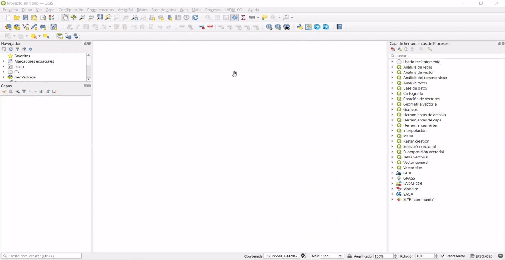

# Captura de datos en campo

La captura en campo es un proceso que permite realizar el levantamiento predial en terreno de una zona de interés por parte del Operador y entregada al Gestor. Se desarrolla en varias actividades entre las que se tienen:

1. Alistamiento de insumos (ver [Gestión de insumos](st-docs/user-manual-doc/9-rol-operador.html#gestion-de-insumos))
2. ETL de submodelo de insumos a Modelo de captura en campo
3. Asignación de zonas de trabajo y predios por parte del Coordinador General
4. Asignación de zonas de trabajo y predios por parte del Coordinador de Campo
5. Levantamiento en campo por parte de los reconocedores
6. Sincronización de datos de campo por parte del Coordinador de Campo
7. Sincronización de datos de campo por parte del Coordinador General
8. ETL de Modelo de captura en campo a Modelo de aplicación Lev.Catastral 

El Asistente LADM-COL apoya en la realización de estas actividades y con la ayuda de algunas imágenes gif se orienta como llevarlas a cabo a partir de las funcionalidades asignadas a cada perfil.

***
ETL (Submodelo Insumos - Modelo Captura en Campo) EN DESARROLLO
***

## Asignar predios

La asignación de zonas de trabajo y predios por parte del Coordinador General, corresponde a asignar (entregar conjunto de datos) grupo de predios del municipio o zona de intervención a los coordinadores de campo para que ellos asignen la carga de trabajo a cada uno de sus reconocedores de campo y con ello se realice el levantamiento catastral del total de la zona de trabajo. A continuación se muestra en los gif cada uno de los pasos que realiza el Coordinador General y el Coordinador de Campo utilizando el Asistente LADM-COL.

#### Coordinador General

*Perfil encargado de asignar a los coordinadores de campo la captura y gestión de los datos provenientes del Levantamiento Catastral*

Selección de perfil de coordinador general  y creación de base de datos maestra.

 Importación archivo (formato XTF) de datos insumos en el modelo de Captura en Campo.

Creación de coordinadores de campo.

Asignación de zonas y predios a coordinadores de campo.

Exportación de conjunto de datos (formato XTF) a coordinadores de campo.

#### Coordinador de Campo

*Perfil encargado de gestionar la la captura de datos de campo provenientes del Levantamiento Catastral*.

Selección de perfil de coordinador de campo.

Creación de base de datos de zona asignada.

Importación de datos insumos en el modelo de Captura en Campo.

Cargue de datos zona asignada e imagen de referencia.

Creación de reconocedores de campo a zona asignada.

Asignación de predios a reconocedores de campo.

Generación de proyectos *QField* a reconocedores.

## Recolección datos en Campo

El reconocedor con su dispositivo móvil puede agregara uno o varios proyectos *QField* que le ha entregado el coordinador de campo, en este proyecto lleva la configuración, formularios, imagen de referencia y simbología necesaria para orientarse e identificar los predios en el terreno y poder realizar el levantamiento catastral de forma eficiente.

TIP

El reconocedor antes de ir a campo debe instalar y configurar en su dispositivo la última versión de <i>QField</i> para poder cargar y vizualizar correctamente los proyectos entregados por el coordinador de campo. (ver manual de <a href="https://swisstierrascolombia.github.io/QField-LADM-COL-docs/">QField para campo</a>)

#### Reconocedor

Almacenamiento y cargue del proyecto *QField* en el dispositivo móvil.

Digitalización de puntos en el dispositivo móvil.

Digitalización de polígonos y edición de formularios.

## Sincronizar datos de campo

Después de capturar los datos de campo se debe realizar el proceso de sincronización que permite la consolidación de los datos obtenidos por cada uno de los reconocedores para un coordinador de campo y a su vez la consolidación de los datos de los coordinadores de campo al coordinador general. A continuación los pasos que se realizan para estas actividades.

#### Coordinador de Campo

Selección de perfil y crear base de datos para importar datos de campo.

Importar y sincronizar los datos provenientes de los reconocedores (archivos GPKG).

Verificar reglas de calidad, corregir y generar archivo XTF para entrega a coordinador general.

#### Coordinador General

Selección de perfil, crear base de datos para importar datos de coordinadores de campo, 

Importar y sincronizar los datos provenientes de los coordinadores de campo (archivos XTF)

verificar reglas de calidad, y consolidar datos de levantamiento catastral.

Al finalizar estas actividades el coordinador general obtiene un archivo XTF final del levantamiento catastral de la zona asignada, la cual se llevara al modelo de aplicación Lev. Catastral con su respectivo proceso de control de calidad y luego será entregada al gestor.
***
ETL (Modelo Captura en Campo - Modelo de Aplicación Lev. Catastral)
