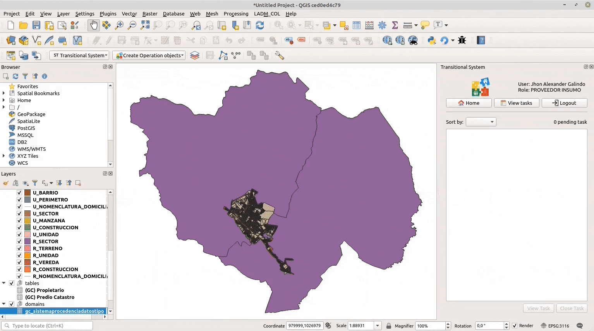

# Sistema de transición

El [Sistema de Transición](https://swisstierrascolombia.github.io/st-docs/index.html)  es una herramienta en un ambiente Web que permite apoyar la gestión de información necesaria para realizar las tareas del barrido predial en campo por parte de las entidades y actores involucrados en el proceso de Levantamiento Catastral en Colombia (Gestores y Operadores Catastrales). El Sistema una vez recibe la solicitud de generación y entrega del insumo “Datos catastrales en modelo de insumos” crea una tarea con sus respectivas credenciales para que el un usuario con perfil técnico asociado al área de trabajo Catastral del Proveedor IGAC pueda autenticarse desde la interfaz del **Asistente LADM** del programa QGIS (herramienta desktop) como se muestra en la siguiente sección e inicie la ejecución de la función ETL (extrae, trasforma y 'load' cargar) y genera el insumo en formato XTF para ser cargado desde la herramienta desktop o directamente en la interfaz de la solicitud del Sistema de Transición.

IMPORTANTE

Para poder utilizar esta funcionalidad desde el Asistente se debe contar con las credenciales (Usuario y contraseña) dentro del Sistema de Transición para realizar la autenticación.

## Autenticación

_Opciones de Autenticación en el Asistente LADM_

Se tiene dos opciones: 

* Opción uno: En el menú desplegable del Asistente la interfaz se activa la entrada de menú "Sistema de Transición" y se da clic en la opción "Logueo" en donde se despliega una ventana emergente, se rellena el formulario con el usuario y contraseña del usuario registrado en el Sistema de Transición y que tiene los privilegios de cargar insumos. Se da clic en el botón "OK" y si las credenciales son validas se informa l usuario que la autenticación es exitosa y carga un panel en la parte derecha de la interfaz donde se le muestra las tareas asignadas al usuario.

* Opción dos: Dar clic en la barra de herramientas y seguir las instrucciones descritas en el párrafo anterior.

## Ver tareas

_Panel de tareas disponibles_ :clipboard:

Despues de haber realizado la autenticación en el Sistema de Transición, en el panel derecho de la interfaz de QGIS dar clic en “Ver tareas” revisar y seleccionar la tarea “Generar insumo catastral” del municipio asignado y dar clic en “iniciar tarea”.                       

_Panel de pasos de tarea iniciada_ :ballot_box_with_check:

TIP

    
Cada vez que se da clic en cada uno de los pasos de un tarea iniciada se marca el <a>:ballot_box_with_check:</a> del paso y cambia de color para indicarle al usuario que ya fue realizada; es posible marcar un paso como realizado sin haberlo ejecutado, solo se da clic directamente en el _checkbox_. El boton "Cerar Tarea" solo se activa para dar clic si todos pasos _obligatorios_ estan chequeados, esto es sutil en el caso de  que se haya iniciado una tarea y ya se cuente con los archivos generados previamente y solo se desee cargar el insumo solicitado.

En la lista de pasos del panel derecho dar doble clic en el _paso 1_ y en la caja de dialogo que aparece seleccionar la base de datos y el esquema en donde se importaran los datos y seleccionar el modelo LADM con el que se desean estructurar los datos para ser entregados al Operador (modelo sugerido: submodelo de insumos V1.0) y luego dar clic en el botón “Crear estructura”. Una vez finalice se da clic en la caja de verificación de la lista de pasos para poder continuar con el siguiente paso.

_Crear estructura en submodelo de insumos_ :gear:

En la lista de pasos del panel derecho dar doble clic en el _paso 2_ “Correr ETL Insumos” y en la siguiente caja de dialogo que aparece seleccionar y cargar los archivos correspondientes en cada campo de acuerdo con su tipo (ver imagen), de los archivos que se alistaron en el paso 0, luego dar clic en el botón “Importar” y esperar a que se ejecute la ETL con éxito y se carguen las capas resultantes al panel de mapa del programa QGIS. Una vez finalice se da clic en la caja de verificación de la lista de pasos para poder continuar con el siguiente paso.

_Correr ETL para generar datos en submodelo de insumos_

En la lista de pasos del panel derecho dar doble clic en el _paso 3_ “Generar XTF” y se desplegará una caja de dialogo en donde se debe seleccionar la ubicación de la carpeta dentro del equipo donde esta instalado el programa QGIS donde se desee almacenar el archivo XTF dando un nombre al archivo con los datos obtenidos con la ETL Cobol o la ETL SNC y luego se da clic en el botón “Exportar datos”, esperar a que termine de generar el archivo XTF y luego dar clic en el botón “Cerrar”. Se da clic en la caja de verificación de la lista de pasos para poder continuar con el siguiente paso.

_Generar archivo XTF_

_(paso Opcional)_ 
En la lista de pasos del panel derecho dar doble clic en el _paso 4_ “Generar informe de Omisiones y comisiones” y en la siguiente caja de dialogo se da la opción de escoger la ubicación de la carpeta dentro del equipo donde  se desee almacenar los archivos del reporte dando un nombre al archivo con los datos obtenidos con la ETL seleccionada que se ejecuto en el _paso 2_  y se da clic en el botón "Generar informe".
**Nota: Este informe es útil para el Gestor y el Operador del Sistema de Transición para conocer el estado de lso datos entregados en el archivo XTF en el submodelo de insumos.**

_Generar informe de Omisiones y Comisiones_ :bookmark_tabs:

## Subir archivo

_Subir archivo al Sistema de Transición_ :file_folder:

En la lista de pasos del panel derecho dar doble clic en el _paso 5_ “Subir XTF” y se desplegará una caja de dialogo en donde se selecciona la carpeta donde se guardo el archivo XTF generado en el paso anterior y luego se coloca una observación en el campo “Comentario” que se enviará al Sistema de Transición y se da clic en el botón “OK” para ser cargado y cuando termine mostrara un mensaje de cargue satisfactorio en la parte superior de la caja de dialogo, se da clic en el botón “Cerrar”. Finalmente se da clic en la caja de verificación de la lista de pasos para terminar.

## Cancelar tarea

_Cancelar una tarea iniciada_ :no_entry:

En el panel lateral donde se listan las tareas se dispone de la opción "Cancelar Tarea" la cual se utiliza en caso de no continuar con una tarea asignada después de haber dado clic en "Iniciar Tarea", esta acción envía un mensaje al Sistema de Transición indicando que se cancelo la tarea y que debe ser eliminada o asignada de nuevo. Para el usuario esta tarea ya no se listara en el panel, a no ser que vuelva a ser asignada desde el Sistema de Transición.

## Salir

_Salir (desautenticarse) del Sistema de Transición_ :negative_squared_cross_mark:

Para finalizar el proceso, en el panel derecho de la interfaz se revisa que todas las cajas de verificación de la lista de pasos tengan su *check* correspondiente para que se active el botón “Cerrar tarea” y se da clic, se despliega una caja de confirmación y se clic en el botón “Si” y aparecerá un mensaje en la parte superior de la caja confirmando que se finalizó correctamente la tarea. Por último, se da clic en el botón “Desautenticar” luego clic en el botón “Si” en la caja de confirmación y aparecerá un mensaje en la parte superior del panel de mapa de la interfaz confirmando que se cerró correctamente la sesión en el Sistema de Transición y se ha cargado el insumo solicitado.

