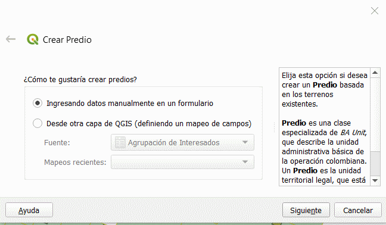

# Captura y Estructuración de Datos

## Preprocesamiento de insumos

## Consulta de dominios

## Paquete de topografía y representación

### Puntos de lindero

### Puntos de levantamiento

### Puntos de Control

### Linderos

### Construcción De Linderos

### Relación Entre Puntos y Linderos

## Unidad Espacial

### Creación De Terrenos y Sus Relaciones

#### Creación De Relacion Entre Los Linderos y Los Terrenos

### Creación De Construcciones

### Creación De Unidades De Construcción

## Unidad Básica Administrativa

Con el objetivo de continuar con el desarrollo del tutorial, es necesario tener en cuenta la imagen que se muestra a continuación.

| Predio 1                                       | Predio 2                                       | Predio 3                                       |
| ---------------------------------------------- | ---------------------------------------------- | ---------------------------------------------- |
| Condición: No propiedad Horizontal             | Condición: No propiedad Horizontal             | Condición: No propiedad Horizontal             |
| Número predial:   251750000000000000000500000001 | Número predial:   251750000000000000000500000002 | Número predial:   251750000000000000000500000003 |
| Tipo: Privado                                  | Tipo: Privado                                  | Tipo: Público                                  |
| Dirección: AV 3 22 d 15                        | Dirección: AV 3 22 d 1                         | Dirección: AV 3 22 d 97                        |

### Crear Predio

#### Paso 1: Crear predio 

Debes seguir la siguiente ruta en el Asistente LADM-COL **LADM-COL –> Captura Y Estructuración De Datos –> Levantamiento Catastral –> Unidad básica administrativa —> Crear Predio**

#### Paso 2: Selección metodo de creación del Predio

Se desplegará un cuadro de diálogo con dos opciones de ingreso de datos. *Desde otra capa de QGIS* o por medio de *Ingresando datos manualmente en un formulario*, debes seleccionar la opción *Ingresando datos manualmente en un formulario* y presionar el botón ``siguiente``. En la siguiente parte de la interfaz se debe elegir el tipo de predio a crear, para eso se recomienda revisar la [imagen](#unidad-basica-administrativa) anterior.

Como se puede observar en la siguiente figura se solicita información del terreno por lo tanto se debe dar clic al al boton seleccionar objetos por area. 

#### Paso 3: Selección de terrenos

Se cerrara el cuadro de diálogo actual y el puntero cambiará a una cruz lo cual indica que ya esta listo para seleccionar el terreno, dabes dar clic sobre el terreno al cual le asignaras información del predio y clic derecho para terminar la selección.

#### Paso 4: Diligenciamiento de formulario

Aparecerá el cuadro de diálogo anterior, en donde debes dar clic en `Crear`, esto despliega un formulario para ser diligenciado, con la información de proporcionada en la [imagen](#unidad-basica-administrativa) al comienzo de esta sección.

IMPORTANTE

Es necesario desarrollar este proceso para los terrenos que aparecen de color <b>rojo</b> en la siguiente imágen.

## Interesados

### Crear Agrupación De Interesados

## Fuentes

## RRR

### Crear Derecho