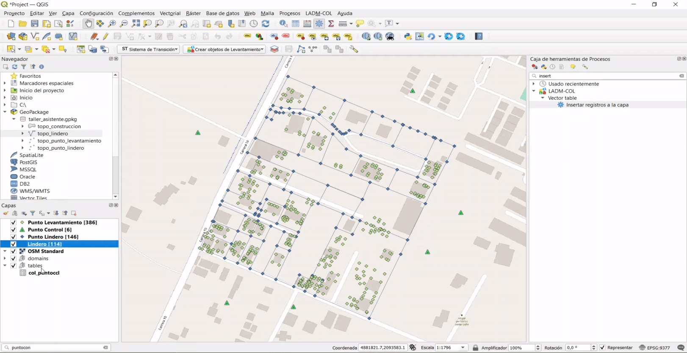

# Captura y Estructuración de Datos

## Alistamiento de insumos

La primera parte de tutorial corresponde a la descarga e importación de datos en QGIS.  Para llevar a cabo cada uno de los pasos, es necesario que descargues el [material de práctica](http://nas-swissphoto.quickconnect.to/d/f/620702901595062139) y sigas las instrucciones del tutorial.

<div class="seealso">
<p class="admonition-title">TIP</p>
<p> Si deseas agregar otras fuentes de información como referencia a la información proporcionada, puedes hacerlo haciendo uso de QGIS y sus diferentes funcionalidades. </p>
</div>

### Paso 1: Conexión a la base de datos 

Para empezar, se debe definir la conexión a la base de datos. Para realizar este proceso, dirígete al panel "**Navegador**" ubicado a la izquierda de la interfaz de QGIS, en el árbol que se despliega ubica la sección **Geopackage**, haz clic derecho sobre esta sección y selecciona la opción de **Conexión nueva**. Una vez se despliega el panel de navegación, deberás ubicar la base de datos **taller_asistente.gpkg** (disponible en los datos del tutorial) y dar clic en el botón **Abrir** para configurar la conexión a la base de datos.

<div class="note">
<p class="admonition-title">IMPORTANTE</p>
<p> Como resultado de este proceso se tendrá conexión a una base de datos que posee diversa información, de la cual se hará uso a medida que se avance en las secciones de este tutorial. </p>
</div>

<a class="" data-lightbox="Paso 1: Conexión a la base de datos" href="../_static/tutorial/captura_y_estructura_de_datos/cap4preinsumos1.gif" title=" Paso 1: Conexión a la base de datos " data-title=" Paso 1: Conexión a la base de datos "></a>

<div class="seealso">
<p class="admonition-title">TIP</p>
<p> Con el fin de tener una mejor referencia de la zona de trabajo, se recomienda instalar el complemento <b>QuickMapServices</b>, que proporciona un conjunto de servicios Web que pueden ser utilizados como mapas base. Por ejemplo, algunos permiten desplegar imágenes satelitales sobre el mapa. </p>
</div>

<a class="" data-lightbox="Paso 1: QuickMapService" href="../_static/tutorial/captura_y_estructura_de_datos/cap4preinsumos2.gif" title="Paso 1: QuickMapService" data-title="Paso 1: QuickMapService"></a>

## Consulta de dominios

### Paso 1: Tabla de atributos

Para proceder a la consulta de dominios debes dirigirte al grupo "**domains**" ubicado en el panel de capas de QGIS, abrir el grupo y buscar el dominio de interés. Sobre éste debes dar clic derecho y seleccionar la opción **Abrir tabla de atributos** en el menú de contexto que se despliega.

El ejemplo que se muestra a continuación se desarrolla con la capa **lc\_puntotipo**.

<a class="" data-lightbox="Paso 1: Tabla de atributos" href="../_static/tutorial/captura_y_estructura_de_datos/cap4preinsumos9.png" title="Paso 1: Tabla de atributos" data-title="Paso 1: Tabla de atributos"></a>

<div class="seealso">
<p class="admonition-title">TIP</p>
<p>Puedes acceder a la tabla de atributos de la capa de interés, ubicándote sobre la misma en el panel de capas y tecleando <b>F6</b>.</p>
</div>

### Paso 2: Identificación del T_Id

Se desplegará un diálogo con el listado de los valores del dominio seleccionado. De esta manera es posible identificar el número correspondiente al campo de descripción del elemento requerido, ubicado en la columna **t_id**.

<a class="" data-lightbox="Paso 2: Identificación del T_Id" href="../_static/tutorial/captura_y_estructura_de_datos/cap4preinsumos10.png" title="Paso 2: Identificación del T_Id" data-title="Paso 2: Identificación del T_Id"></a>

## Paquete de topografía y representación

### Puntos de lindero

#### Paso 1: Creación de punto lindero

Entiéndase *'Puntos de lindero'* como aquellos que definen los límites de un terreno.

Para este procedimiento, debes seguir la ruta **LADM-COL -> Captura y estructuración de datos -> Levantamiento Catastral -> Topografía y Representación -> Crear Punto**.

<a class="" data-lightbox="Paso 1: Creación de punto lindero" href="../_static/tutorial/captura_y_estructura_de_datos/cap4preinsumos3.png" title="Paso 1: Creación de punto lindero" data-title="Paso 1: Creación de punto lindero"></a>

#### Paso 2: Selección del tipo de punto

La acción anterior desplegará un cuadro de diálogo con la opción para seleccionar la clase de punto que se desea importar. En este caso, selecciona **Punto Lindero** y luego haz clic en **Siguiente**.

<a class="" data-lightbox="Paso 2: Selección del tipo de punto" href="../_static/tutorial/captura_y_estructura_de_datos/cap4preinsumos4.png" title="Paso 2: Selección del tipo de punto" data-title="Paso 2: Selección del tipo de punto"></a>

#### Paso 3: Selección de los datos punto lindero

Ahora, debes seleccionar el conjunto de datos. La fuente de estos puede ser un archivo CSV o una capa vectorial. 

Para este caso, elige el conjunto de datos que ya está cargado en la interfaz de QGIS, **topo_punto_lindero**, y procedes a dar clic en el botón `Importar`.

<a class="" data-lightbox="Paso 3: Selección de los datos punto lindero" href="../_static/tutorial/captura_y_estructura_de_datos/cap4preinsumos5.png" title="Paso 3: Selección de los datos punto lindero" data-title="Paso 3: Selección de los datos punto lindero"></a>

#### Paso 4: Mapeo de campos punto lindero

Tan pronto realizes el paso anterior, se genera un cuadro de diálogo en el cual se encuentra el muestreo de la información levantada en campo comparada con la información que requiere el modelo. 

 <a class="" data-lightbox="Paso 4: Mapeo de campos punto lindero" href="../_static/tutorial/captura_y_estructura_de_datos/cap4preinsumos6.png" title="Paso 4: Mapeo de campos punto lindero" data-title="Paso 4: Mapeo de campos punto lindero"></a>

<div class="warning">
<p class="admonition-title">ADVERTENCIA</p>
<p>Resulta de gran importancia esta sección ya que es la base de la importación de información restante.</p>
</div>

#### Paso 5: Asignación de campos punto lindero

La capa **lc\_punto lindero** cuenta con cinco atributos obligatorios, estos son:

| **Item** | **Entidad**     | **Atributo**         | **Contenido**                |
| -------- | --------------- | -------------------- | ---------------------------- |
| 1        | LC_PuntoLindero | ID_Punto_Lindero     | Cadena de texto              |
| 2        | LC_PuntoLindero | Punto Tipo           | **LC_puntotipo**             |
| 3        | LC_PuntoLindero | Acuerdo              | **LC_Acuerdotipo**           |
| 4        | LC_PuntoLindero | Exactitud Horizontal | Numérico                     |
| 5        | COL_Punto       | MetodoProducción     | **Col_MetodoProduccionTipo** |

Considerando esto, en el cuadro de diálogo del mapeo de campos (imagen anterior) procedes a dar clic en el botón **"Generar expresión"**  para los atributos mencionados en la tabla anterior.

Para la asignación de diferentes **t_id** se hace uso de la siguiente función:

```sql
get_domain_code_from_value('Nombre de la tabla del dominio' (Texto), 
                           valor del dominio a buscar (Texto),
                           Indica si validar conexión o no (Booleano), 
                           Indica si el valor es iliCode o no (Booleano))
```

<a class="" data-lightbox="Paso 5: Asignación de campos punto lindero" href="../_static/tutorial/captura_y_estructura_de_datos/cap4preinsumos12.png" title="Paso 5: Asignación de campos punto lindero" data-title="Paso 5: Asignación de campos punto lindero"></a>0

Para este caso, debes asignar los valores de la siguiente manera:

| Atributo             | Expresión                                                    |
| -------------------- | ------------------------------------------------------------ |
| id_punto_lindero     | id_punto                                                     |
| puntotipo            | get_domain_code_from_value('lc_puntotipo', punto_tipo,True, False) |
| acuerdo              | get_domain_code_from_value('lc_acuerdotipo', acuerdo,True, False) |
| exactitud_horizontal | 1                                                            |
| metodoproduccion     | get_domain_code_from_value('col_metodoproducciontipo', 'Metodo_Directo',True, False) |

<div class="warning">
<p class="admonition-title">ADVERTENCIA</p>
<p>Para el caso de <b>metodoproduccion</b>, se utiliza el texto 'Metodo_Directo' ya que los datos iniciales no cuentan con información para este campo.</p>
</div>

Una vez que se diligencian cada uno de los atributos al interior del formulario, se obtiene el siguiente resultado:

<a class="" data-lightbox="Paso 5: Asignación de campos punto lindero" href="../_static/tutorial/captura_y_estructura_de_datos/cap4preinsumos13.png" title="Paso 5: Asignación de campos punto lindero" data-title="Paso 5: Asignación de campos punto lindero"></a>

#### Paso 6: Resultado de la ejecución punto lindero

Una vez terminado el mapeo de campos, debes dar clic en **Ejecutar** y al terminar el proceso podrás visualizar el siguiente mensaje de validación, después de verificar su contenido se procede a cerrar el cuadro de diálogo.  

<a class="" data-lightbox="Paso 6 Resultado de la ejecución punto lindero" href="../_static/tutorial/captura_y_estructura_de_datos/cap4preinsumos15.png" title="Paso 6 Resultado de la ejecución punto lindero" data-title="Paso 6 Resultado de la ejecución punto lindero"></a>

### Puntos de levantamiento

#### Paso 1: Cargue de insumos

Inicialmente, se procede a arrastrar el insumo de **topo_puntos_levantamiento** al menú de capas de QGIS.

<a class="" data-lightbox="Paso 1: Cargue de insumos punto levantamiento" href="../_static/tutorial/captura_y_estructura_de_datos/cap4preinsumos16.gif" title="Paso 1: Cargue de insumos punto levantamiento" data-title="Paso 1: Cargue de insumos punto levantamiento"></a>

#### Paso 2: Creación de punto levantamiento

Para iniciar con el proceso de importación debes dirigirte a la barra de herramientas del plugin **Crear objetos de levantamiento -> Crear punto**.

<a class="" data-lightbox="Paso 2: Creación de punto levantamiento" href="../_static/tutorial/captura_y_estructura_de_datos/cap4preinsumos16.png" title="Paso 2: Creación de punto levantamiento" data-title="Paso 2: Creación de punto levantamiento"></a>

#### Paso 3: Selección de los datos punto levantamiento

Posteriormente, se desplegará un cuadro de diálogo donde se deberá seleccionar el tipo de punto a insertar, en este caso: **Punto Levantamiento**, confirma por medio del botón `Siguiente` , y escoge el conjunto de datos para el procesamiento, que para este caso corresponde con **topo_punto\_levantamiento** y finalmente presiona el botón `Importar`.

<a class="" data-lightbox="Paso 3: Selección de los datos punto levantamiento" href="../_static/tutorial/captura_y_estructura_de_datos/cap4preinsumos17.gif" title="Paso 3: Selección de los datos punto levantamiento" data-title="Paso 3: Selección de los datos punto levantamiento"></a>

#### Paso 4: Mapeo de campos punto levantamiento  

Se desplegará un cuadro de diálogo de mapeo de campos de la información. Se recomienda tener en cuenta los pasos desarrollados en el [paso 4](#paso-4-mapeo-de-campos-punto-lindero) de la sección de punto de lindero. Para este caso, debemos asignar los valores de la siguiente manera:

| Atributo                 | Expresión                                                    |
| ------------------------ | ------------------------------------------------------------ |
| id_punto_levantamiento   | id                                                           |
| puntotipo                | get_domain_code_from_value('lc_puntotipo', punto_tipo,True, False) |
| tipo_punto_levantamiento | get_domain_code_from_value('lc_puntolevtipo', "Construccion",True, False) |
| exactitud_horizontal     | 1                                                            |
| metodoproduccion         | get_domain_code_from_value('col_metodoproducciontipo', 'Metodo_Directo',True, False) |

<div class="warning">
<p class="admonition-title">ADVERTENCIA</p>
<p>Para el caso de <b>metodoproduccion</b>, se utiliza el texto 'Metodo_Directo' ya que los datos iniciales no cuentan con información para este campo.</p>
<p>Para el caso de <b>tipo_punto_levantamiento</b>, se utiliza el texto 'Construccion' ya que los datos iniciales no cuentan con información para este campo.</p>
</div>

<a class="" data-lightbox="Paso 4: Mapeo de campos punto levantamiento" href="../_static/tutorial/captura_y_estructura_de_datos/cap4preinsumos18.png" title="Paso 4: Mapeo de campos punto levantamiento" data-title="Paso 4: Mapeo de campos punto levantamiento"></a>

Después, debes activar el proceso por medio del botón `Ejecutar` obtienes el siguiente resultado:

<a class="" data-lightbox="Resultado punto lindero" href="../_static/tutorial/captura_y_estructura_de_datos/cap4preinsumos19.png" title="Resultado punto lindero" data-title="Resultado punto lindero"></a>   

### Puntos de Control

#### Paso 1: Importación del CSV puntos de control

Para importar los *'Puntos de Control'*, se hará a través de un archivo de extensión \*.csv para ello debes abrir el **Administrador de fuentes de datos** de QGIS del cual despliega una interfaz, donde se debe seleccionar la **texto delimitado**, seguido es necesario seleccionar la opción **CSV (valores separados por coma)** y posteriormente en la casilla de nombre del archivo presionas el botón de los tres puntos y así ubicar el archivo **topo_punto_control.csv** dentro de los recursos suministrados.

<a class="" data-lightbox="Paso 1: Importación del csv puntos de control" href="../_static/tutorial/captura_y_estructura_de_datos/cap4preinsumos21.gif" title="Paso 1: Importación del csv puntos de control" data-title="Paso 1: Importación del csv puntos de control"></a>

#### Paso 2: Definición de la geometría

En esta interfaz debes dirigirte a desplegar las opciones de **definición de la geometría**, verificar que en el **campo X** se encuentre el atributo **lon**, que en el **campo Y** esté el atributo **lat** y por último, que en el **SRC de la geometría** se relacione la proyección **9377 - MAGNA-SIRGAS / Origen-Nacional**.

Una vez que se cumpla con estos requisitos mencionados anteriormente, se debe dar clic en el botón `Añadir`.

<a class="" data-lightbox="Paso 2: Definición de la geometría punto control" href="../_static/tutorial/captura_y_estructura_de_datos/cap4preinsumos22.gif" title="Paso 2: Definición de la geometría punto control" data-title="Paso 2: Definición de la geometría punto control"></a>

#### Paso 3: Creación de punto control

Para iniciar con el proceso de importación debes dirigirte a la barra de herramientas del plugin **Crear objetos de levantamiento -> Crear punto**.

 <a class="" data-lightbox="Paso 3: Creación de punto control" href="../_static/tutorial/captura_y_estructura_de_datos/cap4preinsumos16.png" title="Paso 3: Creación de punto control" data-title="Paso 3: Creación de punto control"></a>

#### Paso 4: Selección de los datos punto control

Posteriormente, se desplegará un cuadro de diálogo donde se deberá seleccionar el tipo de punto a insertar, en este caso: **Punto Control**, confirma por medio del botón `Siguiente`, y escoge el conjunto de datos para el procesamiento, que para este caso corresponde con **topo_punto\_control** y finalmente presiona el botón `Importar`.

<a class="" data-lightbox="Paso 3: Selección de los datos punto levantamiento" href="../_static/tutorial/captura_y_estructura_de_datos/cap4preinsumos23.gif" title="Paso 3: Selección de los datos punto levantamiento" data-title="Paso 3: Selección de los datos punto levantamiento"></a>

#### Paso 5: Mapeo de campos punto control  

Se desplegará un cuadro de diálogo de mapeo de campos de la información. Se recomienda tener en cuenta los pasos desarrollados en el [paso 4](#paso-4-mapeo-de-campos-punto-lindero) de la sección de punto de lindero. Para este caso, debes asignar los valores de la siguiente manera:

| Atributo                 | Expresión                                                    |
| ------------------------ | ------------------------------------------------------------ |
| id_punto_levantamiento   | nombre                                                       |
| puntotipo                | get_domain_code_from_value('lc_puntotipo', punto_tipo,True, False) |
| tipo_punto_control       | get_domain_code_from_value('lc_puntocontroltipo', "Control",True, False) |
| exactitud_horizontal     | 1                                                            |
| exactitud_vertical       | 1                                                            |
| metodoproduccion         | get_domain_code_from_value('col_metodoproducciontipo', 'Metodo_Directo',True, False) |

<div class="warning">
<p class="admonition-title">ADVERTENCIA</p>
<p>Para el caso de <b>metodoproduccion</b>, se utiliza el texto 'Metodo_Directo' ya que los datos iniciales no cuentan con información para este campo.</p>
<p>Para el caso de <b>tipo_punto_control</b>, se utiliza el texto 'Control' ya que los datos iniciales no cuentan con información para este campo.</p>
</div>

<a class="" data-lightbox="Paso 5: Mapeo de campos punto control" href="../_static/tutorial/captura_y_estructura_de_datos/cap4preinsumos24.png" title="Paso 5: Mapeo de campos punto control" data-title="Paso 5: Mapeo de campos punto control"></a>

Después, debes activar el proceso por medio del botón `Ejecutar`, y así obtener el siguiente resultado:

<a class="" data-lightbox="Resultado punto control" href="../_static/tutorial/captura_y_estructura_de_datos/cap4preinsumos25.png" title="Resultado punto control" data-title="Resultado punto control"></a>   

### Linderos

#### Paso 1: Cargue capa topo lindero

El proceso de creación de linderos es muy similar a la creación de puntos, iniciamos con la carga de la información suministrada **topo_lindero**, de la siguiente manera:

  <a class="" data-lightbox="Paso 1: Cargue capa topo lindero" href="../_static/tutorial/captura_y_estructura_de_datos/cap4preinsumos27.gif" title="Paso 1: Cargue capa topo lindero" data-title="Paso 1: Cargue capa topo lindero"></a>

#### Paso 2: Creación de linderos

Presione el botón ``Crear objetos de levantamiento`` y seleccione la opción **Crear lindero**, esto despliega un nuevo cuadro de diálogo en el cual debes elegir la opción de **Desde otra capa de QGIS** y seleccionar la capa recién cargada **topo_lindero**, posteriormente, das clic en el botón ``Importar``.

<a class="" data-lightbox="Paso 2: Creación de linderos" href="../_static/tutorial/captura_y_estructura_de_datos/cap4preinsumos28.gif" title="Paso 2: Creación de linderos" data-title="Paso 2: Creación de linderos"></a>

#### Paso 3: Mapeo de campos lindero 

Se desplegará un cuadro de diálogo de mapeo de campos de la información. Se recomienda tener en cuenta los pasos desarrollados en el [paso 4](#paso-4-mapeo-de-campos-punto-lindero) de la sección de punto de lindero. Para este caso, debemos asignar los valores de la siguiente manera:

| Atributo                 | Expresión                                                    |
| ------------------------ | ------------------------------------------------------------ |
| longitud                 | $length                                                      |

<div class="warning">
<p class="admonition-title">ADVERTENCIA</p>
<p>Para el caso de <b>longitud</b>, se utiliza la expresión <i>$length</i> ya que los datos iniciales no cuentan con información para este campo.</p>
</div>

<a class="" data-lightbox="Paso 3: Mapeo de campos lindero" href="../_static/tutorial/captura_y_estructura_de_datos/cap4preinsumos24.png" title="Paso 3: Mapeo de campos lindero" data-title="Paso 3: Mapeo de campos lindero"></a>

Después, debes activar el proceso por medio del botón `Ejecutar`. De esta manera obtienes el siguiente resultado:

<a class="" data-lightbox="Resultado linderos" href="../_static/tutorial/captura_y_estructura_de_datos/cap4preinsumos25.png" title="Resultado linderos" data-title="Resultado linderos"></a>

#### Paso 4: Construcción De Linderos

<div class="seealso">
<p class="admonition-title">TIP</p>
<p>Lindero es la línea continua que separa un terreno de otro.</p>
</div>

En el paso anterior se generó un conjunto de segmentos de línea a partir de los **puntos de lindero** y la capa **topo_punto_lindero**. Con el objetivo de crear los linderos correctamente, es necesario que uses la herramienta ``Construir linderos``.

Para acceder a esta herramienta, debes dirigirte a la barra de herramientas y dar clic en el botón ``Construir linderos``. Se habilita un cuadro de diálogo en donde se pregunta: *¿Desea utilizar todos los linderos de la base de datos?*. Debes dar clic en *Sí* y cuando termine el proceso, click en ``Conmutar edición`` y guardar los cambios.

<a class="" data-lightbox="Paso 4: Construcción De Linderos" href="../_static/tutorial/captura_y_estructura_de_datos/cap4preinsumos31.gif" title="Paso 4: Construcción De Linderos" data-title="Paso 4: Construcción De Linderos"></a>

### Relación entre Puntos y Linderos

#### Paso 1: Creación de la relación

Se debe dar clic en el botón ``Llenar PuntosCCL`` ubicado en la barra de herramientas. Se despliega un cuadro de diálogo en donde se te consulta si: *¿Quiere llenar la tabla 'col_puntoccl' para todos los linderos de la base de datos?*. Para este caso debeS dar clic en el botón ``Si``.

<a class="" data-lightbox="Paso 1: Creación de la relación" href="../_static/tutorial/captura_y_estructura_de_datos/cap4preinsumos34.png" title="Paso 1: Creación de la relación" data-title="Paso 1: Creación de la relación"></a>


#### Paso 2: Verificación de la relación

Para identificar si el proceso se generó correctamente se puede abrir la tabla de atributos de la capa **col_puntoccl**, la cual se encuentra en el grupo de *tables*. 

Una vez que te ubiques sobre la capa **col_puntoccl**, debes dar clic en el boton ``Abrir tabla de atributos`` y se visualizará la información registrada.

<a class="" data-lightbox="Paso 2: Verificación de la relación" href="../_static/tutorial/captura_y_estructura_de_datos/cap4preinsumos35.png" title="Paso 2: Verificación de la relación" data-title="Paso 2: Verificación de la relación"></a>

## Unidad Espacial

### Creación De Terrenos y Sus Relaciones

#### Creación De Relación Entre Los Linderos y Los Terrenos

### Creación De Construcciones

### Creación De Unidades De Construcción

## Unidad Básica Administrativa

### Crear Predio

## Interesados

### Crear Agrupación De Interesados

## Fuentes

## RRR

### Crear Derecho