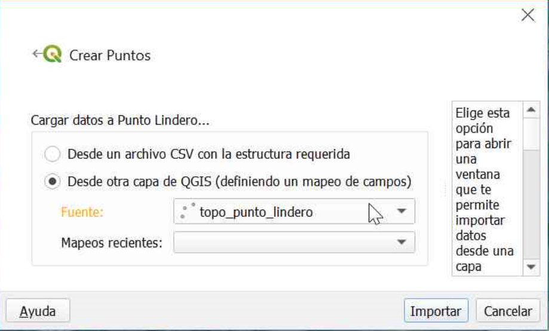
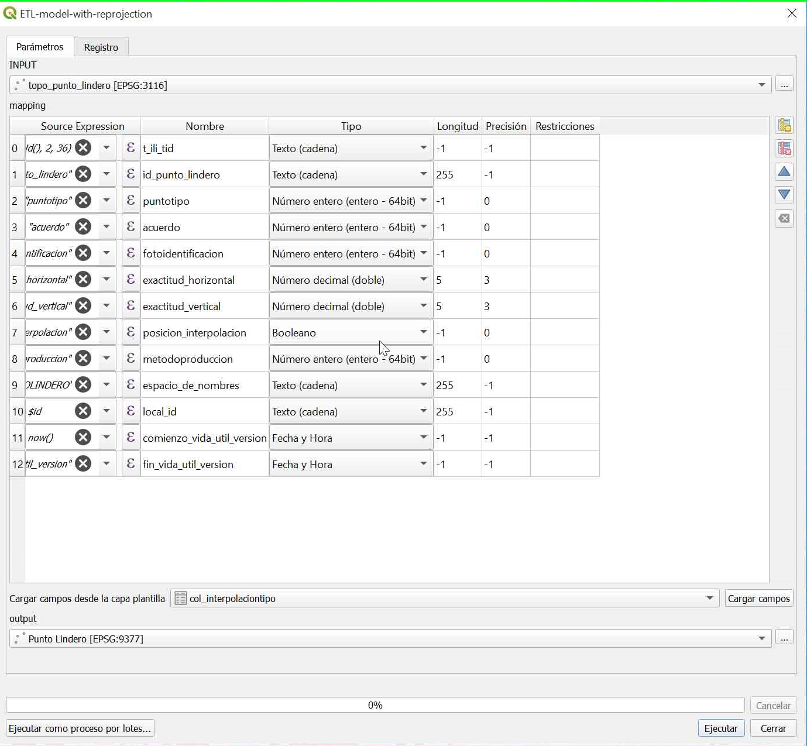
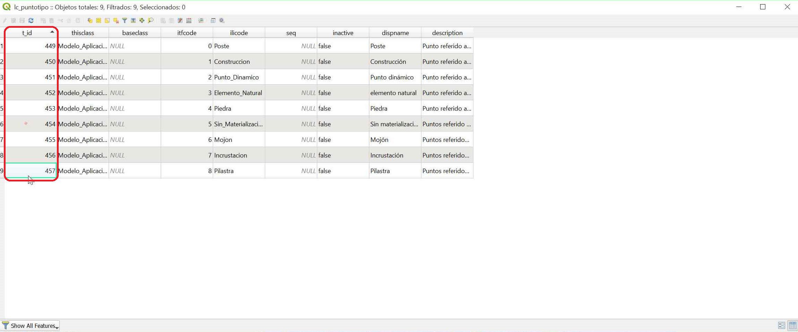
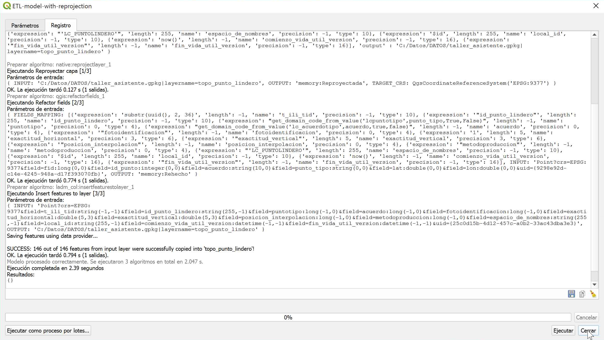
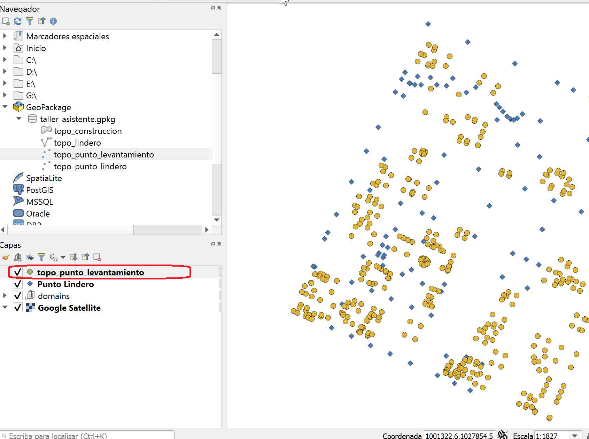
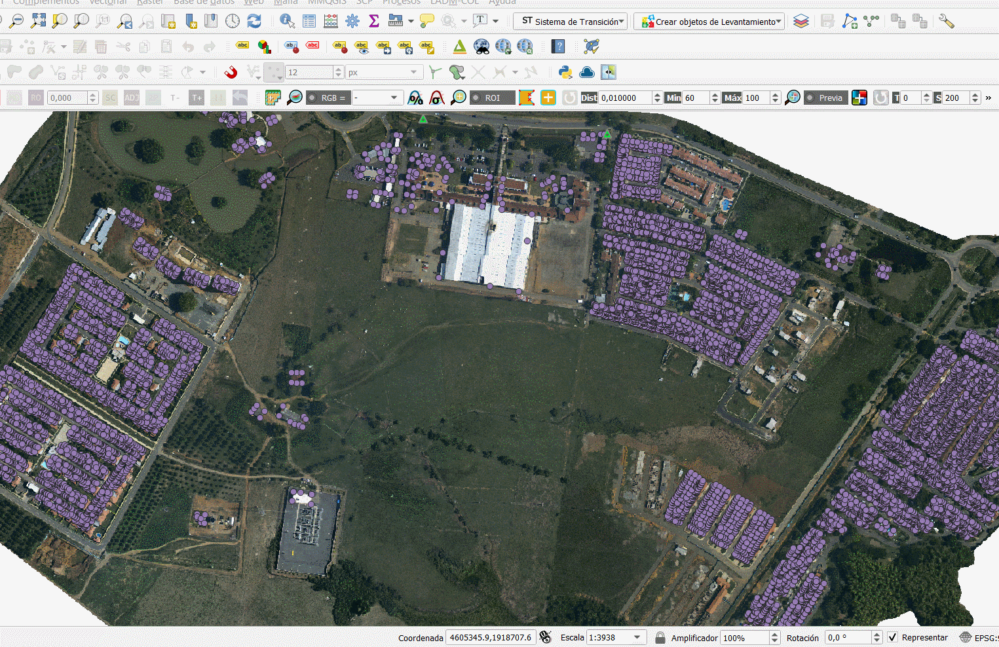
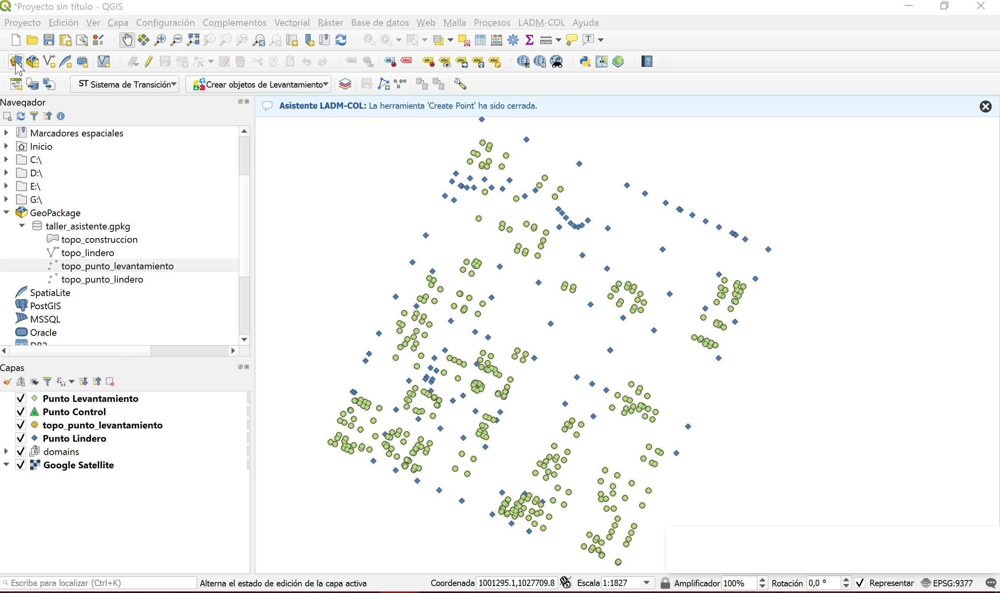
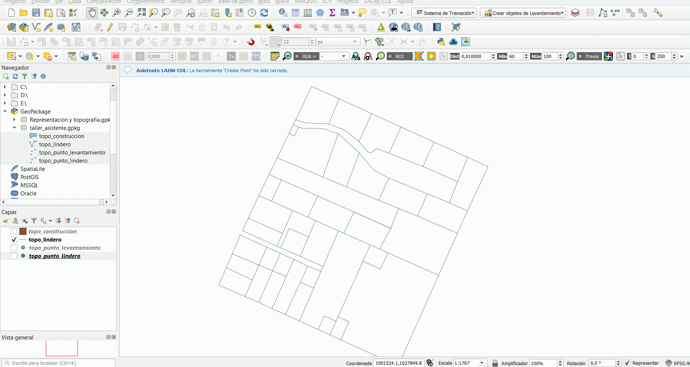
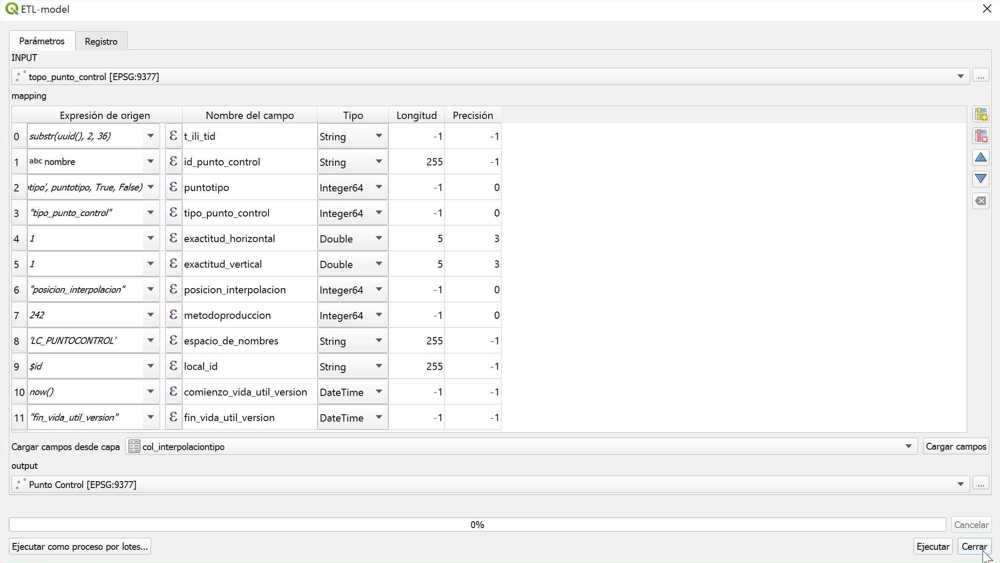
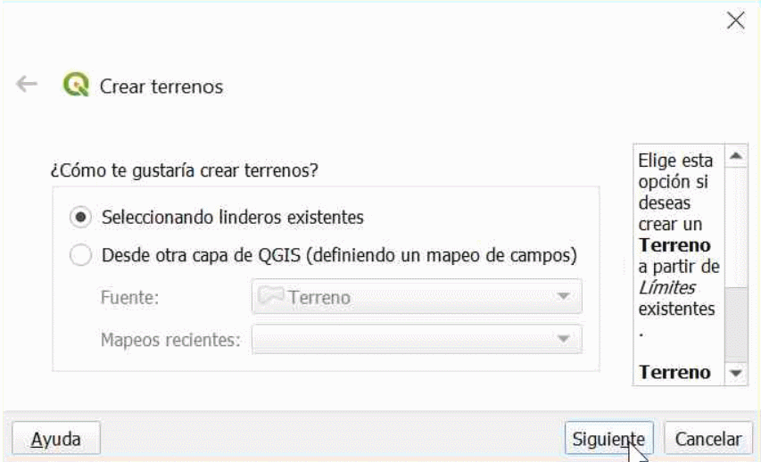

# Captura y Estructuración de Datos
## Preprocesamiento de insumos
Se iniciará con el proceso de importación de datos, para el desarrollo de este documento, se harán con información en formato Geopackage, cabe aclarar que se puede implementar otras fuentes de información en sus diversos formatos ya sea shapefile, archivos CSV etc. Se ha dispuesto un material de práctica que podrá descargar de manera gratuita con el fin de que desarrolle el siguiente ejercicio de aplicación de la herramienta.

<http://bit.ly/TallerAsistente>

Se comenzará con el proceso de conexión, a partir del panel de navegación ubicado a la izquierda de la interfaz de Qgis , ubicar el gestor **Geopackage** con clic derecho y posteriormente seleccionar la opción de **Conexión nueva** para ubicar la base de datos que posee la información necesaria para seguir avanzando.

Como resultado de este proceso se tendrá conexión a una base de datos que posee diversa información, de la cual se hará uso a medida que se avance en los capítulos de este documento.

   

Con el fin de tener una mejor perspectiva de manera visual es recomendable instalar el complemento **Quick Map Server** ya que, proporciona un set de imágenes satelitáles que podrá utilizar para entender un poco más lo realizado en campo.

   
   

IMPORTANTE

 Para mas información de este plugin, podrá consultar el siguiente link donde se detalla el proceso de instalación: [Quick Map
    server](https://mappinggis.com/2016/09/plugin-quickmapservices-capas-base-de-google-landsat-openstreetmap-para-qgis/)

## Paquete de topografía y representación
### Puntos de lindero

1.  Entiéndase como puntos linderos aquellos que definen los límites de un terreno, entonces siguiendo la **ruta LADM-COL – captura y estructuración de datos – levantamiento Catastral- Topografía y representación – crear punto**.

  

2.  De forma inmediata se desplegará un cuadro de diálogo con la opción de seleccionar que clase de punto desea importar, en este caso será **punto lindero,** presionar **Siguiente**

  
  
3. Ahora se selecciona el set de datos ya sea de una fuente archivo CSV o una capa vectorial, en este caso elegir el conjunto de datos que ya esta cargado en el interfaz de Qgis. Que es **topo_punto_lindero**, y procedemos a dar clic en el botón **importar.**
  
 
 
4. Se genera un cuadro de diálogo, donde se lleva a cabo un muestreo de la información levantada contra la información que requiere el modelo. Se considera de gran importancia detallar esta sección ya que, es la base del resto de importaciones que se explicarán en este documento. Para ello es necesario observar el modelo.

 

A continuación se podrá ver la sección de punto lindero de [Modelo_Aplicación_LADMCOL_Lev_Cat_V1_0](https://raw.githubusercontent.com/SwissTierrasColombia/LADM_COL/master/Catastro_Multiproposito/1_Metamodelo_Extendido/1_Catastro_Registro/Modelo_Extendido_LADMCOL_Cat_Reg_V3_0.png) donde es posible consultar el repositorio de SwissTierras y ver futuras actualizaciones del mismo, esto se hace con el fin de identificar los campos obligatorios que debe tener la información al momento de ser importada y poder trabajar con el asistente usando sus funcionalidades de captura masiva.

Se debe tener en cuenta que existen entidades asociadas a otras, las cuales guardan una relación directa, por lo tanto, en este caso según la figura 7 es necesario analizar tanto **LC\_PuntoLindero** como **COL_Punto** teniendo en cuenta los criterios presentados en la siguiente imagen.

 

 
 
Posteriormente se debe identificar el dominio de aquellos valores, que poseen un tipo de información determinada como es el caso del punto tipo, el cual tiene asignado los valores de LC_PuntoTipo según la imagen anterior.

#### Consulta de dominios
1.  Para proceder a la consulta de dominios diríjirse al grupo **domains** ubicado en el panel de capas, abrir el grupo y proceder a buscar el dominio de interés, en este caso se desarrollará con el Lc\_topo_punto

 
 
2.  Se desplegará un cuadro de diálogo con el listado de dominios existentes, lo que se busca es identificar el número correspondiente al campo de descripción del elemento requerido, ubicado en la columna **t_id,** ya que, para un manejo óptimo de bases de datos, se recomienda trabajar con identificadores numéricos

 
 
Finalmente se retoma *el paso 4 del presente documento*, esta vez teniendo en cuenta el modelo LADM-COL y los dominios, por lo tanto, para LC\_ punto lindero posee 5 atributos obligatorios, estos son:

Tabla 1 Atributos obligatorios de la entidad LC_PuntoLindero

| **Item** | **Entidad**     | **Atributo**         | **Contenido**                |
|----------|-----------------|----------------------|------------------------------|
| 1        | COL_Punto       | MétodoProducción     | **Col_MetodoProduccionTipo** |
| 2        | LC_PuntoLindero | ID_Punto_Lindero     | Cadena de texto              |
| 3        | LC_PuntoLindero | Punto Tipo           | **LC_puntotipo**             |
| 4        | LC_PuntoLindero | Acuerdo              | **LC_Acuerdotipo**           |
| 5        | LC_PuntoLindero | Exactitud Horizontal | Numérico                     |

Como se puede observar existen 3 atributos los cuales se les debe asignar un **t_id** en específico. Para lograr esto de forma masiva se procede a desarrollar el paso 5.

5.  En el cuadro de diálogo del muestreo activar el botón href="../_static/tutorial/ICOdialogodeexpressiones.png" title='Boton "Generar expresion"' data-title="Generar expresion"></a>, para aquellos atributos que posean un contenido determinado y solo sea necesario asignar el **t\_id .** Un ejemplo de ello es la columna Punto_tipo de la capa vectorial topo_punto_lindero suministrada, el cual contiene los valores definidos por el modelo, esto se puede ver en la figura 8 con la entidad LC_puntotipo.

Para la asignación de diferentes t_id se hace uso de la función:

-   **get_domain_code_from_value(‘**nombre de la entidad que posee los datos en especifico aceptados por el modelo’ , **‘**nombre de la columna de la capa vectorial suministrada que posee dichos datos’ se indica si los valores a importar estan escritos sin alias (se puede visualizar en la columna ilicode de la tabla de dominios lc_puntotipo , se indica si los valores a importar estan escritos con alias (se puede visualizar en la columna dispname de la tabla de dominios lc_puntotipo)

Para este ejemplo, la manera correcta de escribir la función es:

 **get_domain_code\_from\_value** : (‘’lc_puntotipo’, punto_tipo, True, False)
 
 

6.  Finalmente se recomienda repetir los pasos 5 y 6 de este capítulo para hacer el muestreo total de los datos, al completar la información de los atributos obligatorios se puede activar el botón ejecutar.

 

7.  Finalmente se recomienda repetir los pasos 5 y 6 de este capítulo para hacer el muestreo total de los datos, al completar la información de los atributos obligatorios se puede activar el botón ejecutar.

 
  
8.  si se realiza todo el proceso correctamente podremos visualizar el siguiente mensaje de validación, y posteriormente cerrar el cuadro de diálogo

  
  
 ## Puntos de levantamiento
 1.  Inicialmente se procede arrastra el insumo de topo_puntos_levantamiento.
 
   
 
 2.  para iniciar con el proceso de importación podemos dirigirnos al cajetín **crear objetos de levantamiento – Crear punto**
   
   
   
3.  Posteriormente se activará un cuadro de diálogo donde se deberá seleccionar el tipo de punto a insertar en este caso **punto     levantamiento** después de darle **siguiente** escoger el set de datos para el procesamiento en este caso **topo_punto\_levantamiento** y finalmente presionar el botón **Importar**

   
   
4.  Se desplegará el cuadro de diálogo de muestreo de la información se recomienda tener en cuenta los *pasos 4, 5 y 6 de la presente seccion captura y estructuración de datos,* para el desarrollo de este proceso, lo que se buscar es lograr un muestreo como se indica en la siguiente imagen, al lograrlo proceder a activar el botón ejecutar.   

   
   
   Obteniendo el siguiente resultado 
   
      
 
## Puntos de control 
1.  para importar los puntos control, se hará atreves de un archivo \*.csv para ello vamos **abrir la fuente de administración de datos** de Qgis.

 
 
2.  Se desplegará un cuadro de diálogo, donde se deberá seleccionaremos la fuente de texto delimitado por texto. Seleccionar la opción CSV (valores separados por coma), posteriormente en la casilla de nombre del archivo, presionar la casilla de los tres putos que lo acompañan, se abrirá un cuadro de diálogo, con el fin de que selecciones el archivo de dicho formato y se inicie el proceso de importación de datos
 
 
 3.  Despues de añadir los puntos, dirigirse a la herramienta **crear punto**.

 
 
4.  Seleccionar en tipo de puntos la opción **punto de control**, presionar el botón **siguiente** , de inmediato se cambiara el cuadro de diálogo, donde le solicitara que la fuente de datos que quiere cargar al modelo, seleccionar la alternativa de cargar dicha información **desde otra capa Qgis** y escoger la capa topo\_punto_control recién ingresada y dirigirse al botón **exportar** . 

 
 
5. De inmediato se desplegara la ventana de muestreo donde se recomienda replicar el mismo procedimiento ejecutado en los pasos *4, 5 y 6 del capítulo 4 captura y estructuración de datos,* el objetivo es que pueda obtener un muestreo como el de la siguiente imagen , al finalizar dicho proceso , nos dirigimos al botón **ejecutar**  y después de ver el mensaje de verificación del proceso procedemos a **cerrar** la ventana

 
 
 Al incorporar la información al modelo, el asistente configura la simbología de los puntos como lo muestra la siguiente figura
 
  
  
## Creación de linderos y sus relaciones

1.  El proceso de creación de linderos es muy similar a la creación de puntos, iniciamos con la carga de la información suministrada **topo_lindero**.
  

2.  Presionamos el botón **Crear objetos de levantamiento** y seleccionamos la opción de crear lindero, seleccionamos la opción de **crear el lindero desde otra capa Qgis** y seleccionamos la capa recién cargada posteriormente dar clic en el botón **importar.**

3.  Posteriormente se abre la ventana de muestreo de la información, basados en los pasos *4, 5 y 6 del capítulo 4 captura y estructuración de datos,* podemos observar que el único campo obligatorio es longitud, asi que damos clic  href="../_static/tutorial/ICOdialogodeexpressiones.png" title='Boton "Generar expresion"' data-title="Generar expresion"></a>, y hacemos uso de la función *\$length* , para extraer desde la geometría la longitud damos clic en el botón **Aceptar** y posteriormente en **ejecutar** y **cerrar.**

### Construcción de linderos
Entiéndase como lindero, la línea continua que separa un terreno de otro desde una bifurcación a otra, como se puede observar en la figura 12, hasta el momento no se tienen líneas. Se tienen segmentos de línea generados por los puntos lindero, una opción para corregir este fenómeno es seleccionar cada uno de los segmentos y unirlos, lo
cual quita mucho tiempo si el conjunto de datos a manejar sea grande, es por ello que el asistente cuenta con una herramienta que ayuda automatizar este proceso.

1.  Para acceder a esta funcion solo es direccionarse a la barra de herramientas y dar clic en el boton **construir linderos**

2.  Posteriormente saldrá un cuadro de diálogo, preguntando si desea seleccionar algún tipo de lindero o desea construir los linderos con todas las líneas existentes. Presionamos el botón **sí** y finalmente detenemos la edición y guardamos los cambios.

Como se puede observar en la siguiente imagen en el momento de seleccionar se puede identificar, los linderos bien definidos.

### Relación entre puntos y linderos
1.  Ahora es necesario identificar los puntos que hacen parte de los linderos recién construidos, es decir identificar el **id** de los puntos que conforman un lindero, para ello haremos uso de la herramienta **llenar PuntosCCL** (cara cadena línea). Ubicado en la barra de herramientas

 
 
 2.  Posteriormente saldrá un cuadro de diálogo donde se consulta si se desea crear la relación para un lindero en especifico o para todos los existentes, para este caso se hará con todos por lo tanto daremos clic en el botón **si**
 
  

Para identificar si el proceso se genero correctamente podemos abrir la tabla de atributos de la tabla **col_puntoccl** el cual podra ubicar en el grupo de tables ubicado en el panel de capas como lo muestra la siguiente imagen.

  

Como se puede observar en la figura 15 podemos encontrar la columna ccl diligenciada , dado por el proceso desarrollado

  

## Unidades Espaciales
### Creación de terrenos y sus relaciones
1.  Para crear un terreno basta con ir a la barra de herramientas y activar el  botón **crear objetos de levantamiento** y a continuación seleccionar la opción crear terreno

  
  
2.  Se desplegara un cuadro de diálogo, donde ofrece la opción de cargar una capa vectorial con la información o generar el terreno a partir de los linderos existentes, en
este caso seleccionaremos la opción **seleccionando linderos existentes,**posteriormente damos clic en el botón **siguiente,** de inmediato el cuadro de diálogo cambiara y nos da 3 opciones para seleccionándolos en el mapa, o por medio de una expresión algorítmica o seleccionar todos los linderos existentes en este caso, se recurrirá hacer uso de la ultima utilidad mencionada.

  
  
3.  Como se puede apreciar todos los linderos son seleccionados y son identificados por la herramienta, finalmente procedemos a dar clic en el botón **finalizar**

  
  
4.  Los terrenos ya han sido creados, pero es necesario llenar unos campos obligatorios, para identificar cuales son dichos campos es recomendable tener en cuenta los pasos *4, 5 y 6 de la seccion puntos lindero,* para iniciar con el proceso dar clic en el botón **Abrir tabla de atributos** ubicado en el mensaje emergente al finalizar el paso 3.

 

5.  Se identifico que como único valor obligatorio del terreno es el atributo de área, por lo tanto nos dirigimos al cajetín de asignación de atributos ubicado en la parte superior de la ventana emergente generada al finalizar el paso 4 y buscamos el atributo **Área de terreno**
 
6. Posteriormente damos clic en el botón href="../_static/tutorial/ICOdialogodeexpressiones.png" title='Boton "Generar expresion"' data-title="Generar expresion"></a> se desplegará la ventana de expresiones donde se escribirá la función *\$area* posteriormente damos clic en el botón **Aceptar.** 

 
 
 7.  Finalmente se cerrará esa ventana emergente y solo queda dar clic en el botón **Actualizar lo filtrado**, de inmediato se podrá ver que en la columna en este caso el de
 nombre área de terreno fueron asignadas los valores de área correspondiente y finalmente guardamos dichos cambios presionando el botón href="../_static/tutorial/ICOguardarcambios.png" title='Boton "Guardar Cambios"' data-title="Guardar cambios"></a> y finalmente cerramos la ventana actual.
 
 
 
#### Creación de relacion entre los linderos y los terrenos
### Creación de construcciones
### Creación de unidades de construcción

## Unidad Básica Administrativa
### Crear predio

## Interesados
### Crear agrupación de interesados

## Fuentes

## RRR
### Crear derecho

