# Captura y Estructuración de Datos

## Preprocesamiento de insumos

Se iniciará con el proceso de importación de datos, para el desarrollo de este documento, se harán con información en formato Geopackage, cabe aclarar que se puede implementar otras fuentes de información en sus diversos formatos ya sea shapefile, archivos CSV etc. Se ha dispuesto un material de práctica que podrá descargar de manera gratuita con el fin de desarrollar el siguiente ejercicio de aplicación de la herramienta.

<http://bit.ly/TallerAsistente>

Se comenzará con el proceso de conexión, a partir del panel de navegación ubicado a la izquierda de la interfaz de Qgis , ubicar el gestor **Geopackage** con clic derecho y  seleccionar la opción de **Conexión nueva** para ubicar la base de datos que posee la información necesaria para seguir avanzando.

Como resultado de este proceso se tendrá conexión a una base de datos que posee diversa información, de la cual se hará uso a medida que se avance en las secciones de este tutorial.

   <a class="" data-lightbox="Paso 1" href="../_static/tutorial/captura_y_estructura_de_datos/cap4preinsumos1.gif" title="Paso 1" data-title="Paso 1">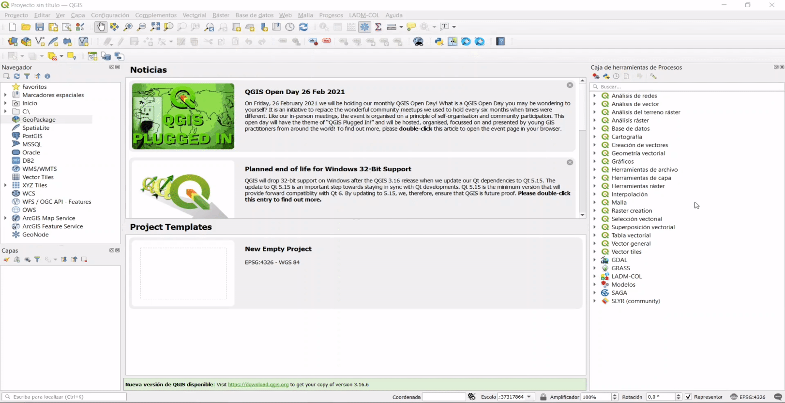</a>

Con el fin de tener una mejor perspectiva es recomendable instalar el complemento **Quick Map Server** que proporciona un conjunto de imágenes satelitales que sirven de referencia en la visualización de la información adquirida en campo.

   <a class="" data-lightbox="Paso 2" href="../_static/tutorial/captura_y_estructura_de_datos/cap4preinsumos2.gif" title="Paso 2" data-title="Paso 2"></a>

## Consulta de dominios

### Paso 1:

Para proceder a la consulta de dominios debes dirigirte al grupo **domains** ubicado en el panel de capas, abrir el grupo y buscar el dominio de interés, sobre esta debes dar click derecho y seleccionar la opción **Abrir tabla de atributos** en el menú que se despliega.

El ejemplo que se muestra a continuación se desarrolla con la capa **lc\_puntotipo**.

<a class="" data-lightbox="Paso 1" href="../_static/tutorial/captura_y_estructura_de_datos/cap4preinsumos9.png" title="Paso 1" data-title="Paso 1"></a>

<div class="seealso">
<p class="admonition-title">TIP</p>
<p>Puedes acceder a la tabla de atributos de la capa de interes, ubicandote sobre el elemento de interes y dando clic en la tecla <b>F6</b></p>
</div>

### Paso 2:

Se desplegará un cuadro de diálogo con el listado de dominios existentes, lo que se busca es identificar el número correspondiente al campo de descripción del elemento requerido, ubicado en la columna **t_id,** ya que, para un manejo óptimo de bases de datos, se recomienda trabajar con identificadores numéricos

 <a class="" data-lightbox="Paso 2" href="../_static/tutorial/captura_y_estructura_de_datos/cap4preinsumos10.png" title="Paso 2" data-title="Paso 2"></a>

 A continuación se podrá ver la sección de punto lindero de [Modelo_Aplicación_LADMCOL_Lev_Cat_V1_0](https://raw.githubusercontent.com/SwissTierrasColombia/LADM_COL/master/Catastro_Multiproposito/1_Metamodelo_Extendido/1_Catastro_Registro/Modelo_Extendido_LADMCOL_Cat_Reg_V3_0.png) donde es posible consultar el repositorio de SwissTierras y ver futuras actualizaciones del mismo, esto se hace con el fin de identificar los campos obligatorios que debe tener la información al momento de ser importada y poder trabajar con el asistente usando sus funcionalidades de captura masiva.

Es importante tener en cuenta que existen entidades asociadas a otras, las cuales guardan una relación directa, por lo tanto, en este caso según lo muestra la siguiente imagen es necesario analizar tanto **LC\_PuntoLindero** como **COL_Punto** teniendo en cuenta los criterios presentados imagen titulada **Entendiendo LADM 2**.

 <a class="" data-lightbox="Entendiendo LADM" href="../_static/tutorial/captura_y_estructura_de_datos/cap4preinsumos7.png" title="Entendiendo LADM" data-title="Entendiendo LADM"></a>

 <a class="" data-lightbox="Entendiendo LADM2" href="../_static/tutorial/captura_y_estructura_de_datos/cap4preinsumos8.png" title="Entendiendo LADM 2" data-title="Entendiendo LADM"></a>
 
Posteriormente se debe identificar el dominio de aquellos valores que poseen un tipo de información determinada como es el caso del **punto tipo**, el cual tiene asignado los valores de LC_PuntoTipo según la imagen anterior.

## Paquete de topografía y representación

### Puntos de lindero

#### Paso 1: Creación de punto

Entiéndase como puntos linderos aquellos que definen los límites de un terreno,  siguiendo la **ruta LADM-COL – captura y estructuración de datos – levantamiento Catastral- Topografía y representación – crear punto**.

  <a class="" data-lightbox="Paso 1: Creación de punto" href="../_static/tutorial/captura_y_estructura_de_datos/cap4preinsumos3.png" title="Paso 1: Creación de punto" data-title="Paso 1: Creación de punto"></a>

#### Paso 2: Selección del tipo de punto

De forma inmediata se desplegará un cuadro de diálogo con la opción de seleccionar que clase de punto desea importar, en este caso será **punto lindero,** presionar **Siguiente**

  <a class="" data-lightbox="Paso 2: Selección del tipo de punto" href="../_static/tutorial/captura_y_estructura_de_datos/cap4preinsumos4.png" title="Paso 2: Selección del tipo de punto" data-title="Paso 2: Selección del tipo de punto">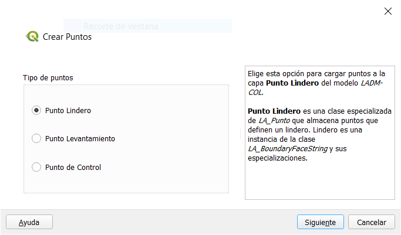</a>

#### Paso 3: Selección de los datos

Ahora se selecciona el set de datos ya sea de una fuente archivo CSV o una capa vectorial, en este caso elegir el conjunto de datos que ya esta cargado en el interfaz de Qgis. Que es **topo_punto_lindero**, y procedemos a dar clic en el botón **importar.**
  
 <a class="" data-lightbox="Paso 3: Selección de los datos" href="../_static/tutorial/captura_y_estructura_de_datos/cap4preinsumos5.png" title="Paso 3: Selección de los datos" data-title="Paso 3: Selección de los datos">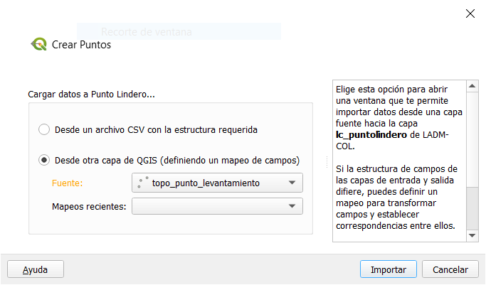</a>

#### Paso 4: Mapeo de campos

Se genera un cuadro de diálogo, donde se lleva a cabo un muestreo de la información levantada contra la información que requiere el modelo. Se considera de gran importancia detallar esta sección ya que, es la base del resto de importaciones que se explicarán en este documento. Para ello es necesario observar el modelo.

 <a class="" data-lightbox="Paso 4: Mapeo de campos" href="../_static/tutorial/captura_y_estructura_de_datos/cap4preinsumos6.png" title="Paso 4: Mapeo de campos" data-title="Paso 4: Mapeo de campos"></a>

La capa **lc\_ punto lindero** cuenta con 5 atributos obligatorios, estos son:

| **Item** | **Entidad**     | **Atributo**         | **Contenido**                |
|----------|-----------------|----------------------|------------------------------|
| 1        | LC_PuntoLindero | ID_Punto_Lindero     | Cadena de texto              |
| 2        | LC_PuntoLindero | Punto Tipo           | **LC_puntotipo**             |
| 3        | LC_PuntoLindero | Acuerdo              | **LC_Acuerdotipo**           |
| 4        | LC_PuntoLindero | Exactitud Horizontal | Numérico                     |
| 5        | COL_Punto       | MétodoProducción     | **Col_MetodoProduccionTipo** |

#### Paso 5: Asignación de campos

En el cuadro de diálogo del mapeo de campos dar clic en el botón "Generar expresión"  para los atributos mencionados en la tabla anterior.

Para la asignación de diferentes t_id se hace uso de la siguiente función:

```python
get_domain_code_from_value('Nombre de la tabla del dominio' (Texto), 
                           valor del dominio a buscar (Texto),
                           Indica si validar conexión o no (Booleano), 
                           Indica si el valor es iliCode o no (Booleano))
```
<a class="" data-lightbox="Paso 5: Asignación de campos" href="../_static/tutorial/captura_y_estructura_de_datos/cap4preinsumos12.png" title="Paso 5: Asignación de campos" data-title="Paso 5: Asignación de campos"></a>

Para este caso debemos asígnar los valores de la siguiente manera:

| Atributo             | Expresión                                                    |
| -------------------- | ------------------------------------------------------------ |
| id_punto_lindero     | id_punto                                                     |
| puntotipo            | get_domain_code_from_value('lc_puntotipo', punto_tipo,True, False) |
| acuerdo              | get_domain_code_from_value('lc_acuerdotipo', acuerdo,True, False) |
| exactitud_horizontal | 1                                                            |
| metodoproduccion     | get_domain_code_from_value('col_metodoproducciontipo', 'Metodo_Directo',True, False) |

<div class="warning">
<p class="admonition-title">ADVERTENCIA</p>
<p>Para el caso de <b>metodoproduccion</b>, se utiliza el texto 'Metodo_Directo' ya que los datos iniciales no cuentan con información para este campo.</p>
</div>

Una vez que se diligencian cada uno de los atributos al interior del formulario, se obtiene el siguiente resultado:

<a class="" data-lightbox="Paso 5: Asignación de campos" href="../_static/tutorial/captura_y_estructura_de_datos/cap4preinsumos13.png" title="Paso 5: Asignación de campos" data-title="Paso 5: Asignación de campos">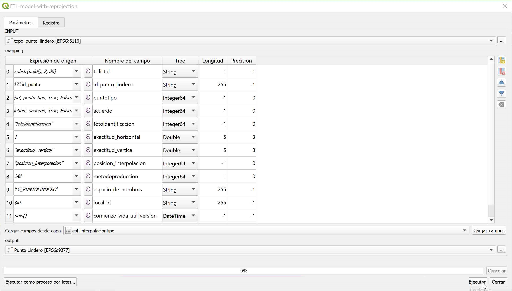</a>

#### Paso 6 Resultado de la ejecución:

Ya terminado el mapeo de campos, debes dar click en Ejecutar y al terminar el proceso tu podras visualizar el siguiente mensaje de validación, y posteriormente cerrar el cuadro de diálogo.

  <a class="" data-lightbox="Paso 6 Resultado de la ejecución" href="../_static/tutorial/captura_y_estructura_de_datos/cap4preinsumos15.png" title="Paso 6 Resultado de la ejecución" data-title="Paso 6 Resultado de la ejecución"></a>
 
### Puntos de levantamiento

#### Paso 1:

Inicialmente se procede arrastra el insumo de topo_puntos_levantamiento.
 
   <a class="" data-lightbox="Paso 1" href="../_static/tutorial/captura_y_estructura_de_datos/
   cap4preinsumos16.png" title="Paso 1" data-title="Paso 1"></a>

#### Paso 2:

Para iniciar con el proceso de importación podemos dirigirnos al cajetín **crear objetos de levantamiento – Crear punto**

#### Paso 3:

Posteriormente se activará un cuadro de diálogo donde se deberá seleccionar el tipo de punto a insertar en este caso **punto     levantamiento** después de darle **siguiente** escoger el set de datos para el procesamiento en este caso **topo_punto\_levantamiento** y finalmente presionar el botón **Importar**
   
   <a class="" data-lightbox="Paso 2" href="../_static/tutorial/captura_y_estructura_de_datos/cap4preinsumos17.gif" title="Paso 2" data-title="Paso 2"></a>

#### Paso 4:   

Se desplegará un cuadro de diálogo de muestreo de la información se recomienda tener en cuenta los *pasos 4, 5 y 6 de la  seccion **punto lindero**,* para el desarrollo de este proceso, lo que se buscar es lograr un muestreo como se indica en la siguiente imagen, al lograrlo proceder a activar el botón ejecutar.   

   <a class="" data-lightbox="Paso 4" href="../_static/tutorial/captura_y_estructura_de_datos/cap4preinsumos18.png" title="Paso 4" data-title="Paso 4">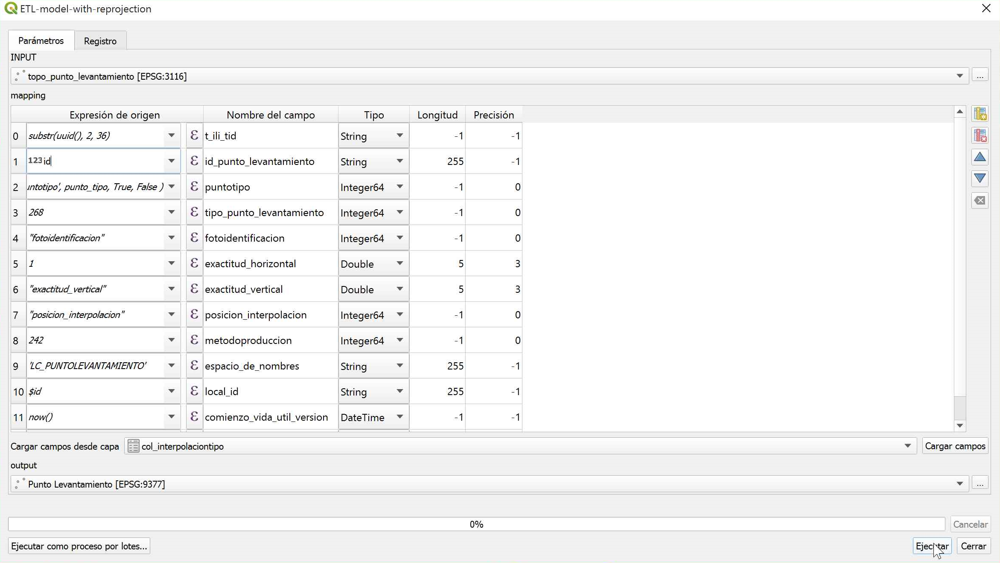</a>
   
   Obteniendo el siguiente resultado 
   
   <a class="" data-lightbox="Resultado" href="../_static/tutorial/captura_y_estructura_de_datos/cap4preinsumos19.png" title="Resultado" data-title="Resultado"></a>   
 
### Puntos de Control

#### Paso 1:

Para importar los puntos control, se hará atreves de un archivo \*.csv para ello vamos **abrir la fuente de administración de datos** de Qgis.

 <a class="" data-lightbox="Paso 1" href="../_static/tutorial/captura_y_estructura_de_datos/cap4preinsumos20.png" title="Paso 1" data-title="Paso 1"></a>

#### Paso 2:

Emergerá un cuadro de diálogo, donde se debe seleccionar la fuente de texto delimitado por texto. Elegir la opción **CSV (valores separados por coma)**, posteriormente en la casilla de nombre del archivo, presionar la casilla de los tres putos que lo acompañan, se abrirá un cuadro de diálogo, donde se ubicará el archivo de dicho formato y se inicie con el proceso de importación de datos

 <a class="" data-lightbox="Paso 2" href="../_static/tutorial/captura_y_estructura_de_datos/cap4preinsumos21.gif" title="Paso 2" data-title="Paso 2"></a>

#### Paso 3:

Despues de añadir los puntos, dirijase a la herramienta **crear punto**.

 <a class="" data-lightbox="Paso 3" href="../_static/tutorial/captura_y_estructura_de_datos/cap4preinsumos22.png" title="Paso 3" data-title="Paso 3"></a>

#### Paso 4:

Seleccionar en tipo de puntos la opción **punto de control**, presionar el botón **siguiente** , de inmediato se cambiara el cuadro de diálogo, donde solicitará la fuente de datos que quiere cargar al modelo, elegir la alternativa de cargar dicha información **desde otra capa Qgis** y escoger la capa **topo\_punto_control** recién ingresada y dirigirse al botón **exportar** . 

 <a class="" data-lightbox="Paso 4" href="../_static/tutorial/captura_y_estructura_de_datos/cap4preinsumos24.gif" title="Paso 4" data-title="Paso 4"></a>

#### Paso 5:

Se desplegará la ventana de muestreo donde se recomienda replicar el mismo procedimiento ejecutado en los pasos **4, 5 y 6 de la seccion punto lindero,** el objetivo es que pueda obtener un muestreo como el de la siguiente imagen , al finalizar dicho proceso , nos dirigimos al botón **ejecutar** al generarse el mensaje de verificación del proceso, **cerrar** la ventana

<a class="" data-lightbox="Paso 5" href="../_static/tutorial/captura_y_estructura_de_datos/cap4preinsumos25.png" title="Paso 5" data-title="Paso 5"></a>

Al incorporar la información al modelo, el asistente configura la simbología de los puntos como lo muestra la siguiente imágen

<a class="" data-lightbox="Resultado" href="../_static/tutorial/captura_y_estructura_de_datos/cap4preinsumos26.png" title="Resultado" data-title="Resultado"></a>
  
## Creación de Linderos y Sus Relaciones

1.  El proceso de creación de linderos es muy similar a la creación de puntos, iniciamos con la carga de la información suministrada **topo_lindero**.

  <a class="" data-lightbox="paso 1" href="../_static/tutorial/captura_y_estructura_de_datos/cap4preinsumos27.png" title="Paso 1" data-title="Paso 1"></a>

2.  Presione el botón **Crear objetos de levantamiento** y seleccione la opción de **crear lindero**, elegir la opción de **crear el lindero desde otra capa Qgis** y se escoge la capa recién cargada, posteriormente dar clic en el botón **importar.**

<a class="" data-lightbox="paso 2" href="../_static/tutorial/captura_y_estructura_de_datos/cap4preinsumos28.gif" title="Paso 2" data-title="Paso 2">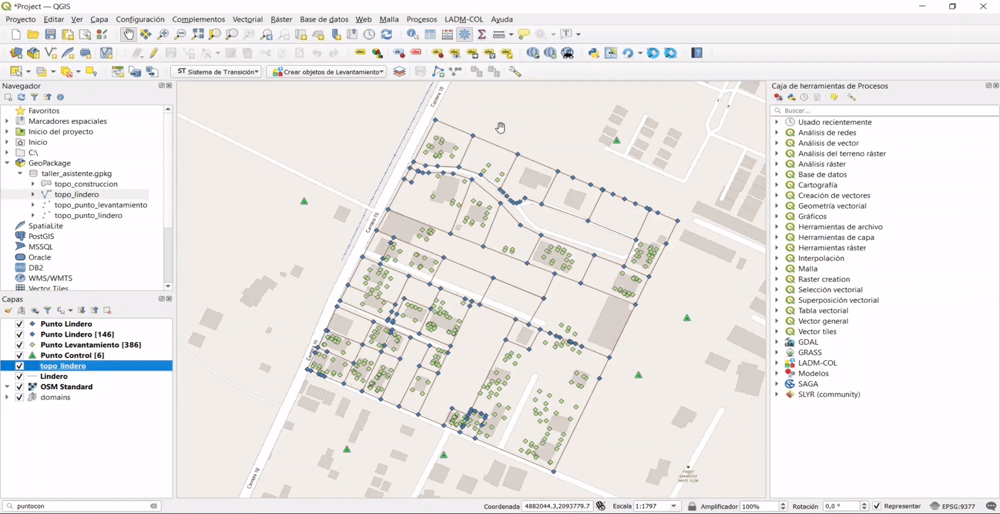</a>

3.  Se abrirá la ventana de muestreo de la información, basados en los pasos **4, 5 y 6 de la seccion punto lindero,**  se puede observar que el único campo obligatorio es longitud, asi que al dar clic en  <a class="" data-lightbox='Botón "Generar expresion"' href="../_static/tutorial/captura_y_estructura_de_datos/ICOdialogodeexpressiones.png" title='Botón "Generar expresion"' data-title='Botón "Generar expresion"'></a>, haciendo uso de la función *\$length* , para extraer desde la geometría la longitud dar clic en el botón **Aceptar** y posteriormente en **ejecutar** y **cerrar.**

<a class="" data-lightbox="paso 3" href="../_static/tutorial/captura_y_estructura_de_datos/cap4preinsumos29.png" title="Paso 3" data-title="Paso 3"></a>

### Construcción De Linderos
Entiéndase como lindero, la línea continua que separa un terreno de otro, como se puede observar en la siguiente imágen. Se tienen segmentos de línea generados por los puntos lindero, una opción para corregir este fenómeno es seleccionar cada uno de los segmentos y unirlos, lo cual quita mucho tiempo si el conjunto de datos a manejar es grande, es por ello que el asistente cuenta con una herramienta que ayuda automatizar este proceso.

<a class="" data-lightbox="introducicon" href="../_static/tutorial/captura_y_estructura_de_datos/cap4preinsumos30.png" title="Paso 1" data-title="Paso 1"></a>

1.  Para acceder a esta herramienta, direccionarse a la barra de herramientas y dar clic en el boton **construir linderos**

<a class="" data-lightbox="paso 1" href="../_static/tutorial/captura_y_estructura_de_datos/cap4preinsumos31.png" title="Paso 1" data-title="Paso 1"></a>

2. Se obtendrá un cuadro de diálogo, preguntando si desea seleccionar algún tipo de lindero o desea construir los linderos con todas las líneas existentes. Presionar el botón **sí** y finalmente detener la edición y guardar los cambios.

<a class="" data-lightbox="paso 1" href="../_static/tutorial/captura_y_estructura_de_datos/cap4preinsumos32.gif" title="Paso 1" data-title="Paso 1"></a>

Como se puede observar en la siguiente imágen, en el momento de seleccionar se puede identificar los linderos bien definidos.

<a class="" data-lightbox="paso 2" href="../_static/tutorial/captura_y_estructura_de_datos/cap4preinsumos33.png" title="paso 2" data-title="Paso 2"></a>

### Relación Entre Puntos y Linderos
1.  Ahora se debe identificar los puntos que hacen parte de los linderos recién construidos, es decir, identificar el **id** de los puntos que conforman un lindero, para ello se hará uso de la herramienta **llenar PuntosCCL** (cara cadena línea). Ubicado en la barra de herramientas

 <a class="" data-lightbox="paso 1" href="../_static/tutorial/captura_y_estructura_de_datos/cap4preinsumos34.png" title="paso 1" data-title="Paso 1"></a>
 
 2.  Se obtendrá un cuadro de diálogo donde se consulta si se desea crear la relación para un lindero en especifico o para todos los existentes, para este caso se hará con todos por lo tanto dar clic en el botón **si**
 
  <a class="" data-lightbox="paso 2" href="../_static/tutorial/captura_y_estructura_de_datos/cap4preinsumos35.png" title="paso 2" data-title="Paso 2"></a>

Para identificar si el proceso se generó correctamente se puede abrir la tabla de atributos de la tabla **col_puntoccl** el cual podra ubicar en el grupo de tables ubicado en el panel de capas como lo muestra la siguiente imagen.

  <a class="" data-lightbox="Resultado" href="../_static/tutorial/captura_y_estructura_de_datos/cap4preinsumos36.png" title="Resultado" data-title="Resultado"></a>

Como se puede observar en la siguiente imágen encontrará la columna ccl diligenciada , gracias al proceso desarrollado

  <a class="" data-lightbox="Resultado" href="../_static/tutorial/captura_y_estructura_de_datos/cap4preinsumos37.png" title="Resultado" data-title="Resultado"></a>

## Unidades Espaciales
### Creación De Terrenos y Sus Relaciones
1.  Para crear un terreno se debe ir a la barra de herramientas y activar el  botón **crear objetos de levantamiento** y  seleccionar la opción crear terreno

  <a class="" data-lightbox="Paso 1" href="../_static/tutorial/captura_y_estructura_de_datos/cap5undespaciales1.png" title="Paso 1" data-title="Paso 1"></a>
  
2.  Se desplegará un cuadro de diálogo, donde ofrece la opción de cargar una capa vectorial con la información o generar el terreno a partir de los linderos existentes, en
este caso elegir la opción **seleccionando linderos existentes,** posteriormente damos clic en el botón **siguiente,** de inmediato el cuadro de diálogo cambiará generando 3 opciones, ya sea seleccionar la informacion desde el mapa, por medio de una expresión algorítmica o seleccionar todos los linderos existentes en este caso, se recurrirá hacer uso de la ultima utilidad mencionada.

  <a class="" data-lightbox="Paso 2" href="../_static/tutorial/captura_y_estructura_de_datos/cap5undespaciales2.gif" title="Paso 2" data-title="Paso 2"></a>
  
3.  Como se puede apreciar todos los linderos son seleccionados y son identificados por la herramienta, se procede a dar clic en el botón **finalizar**

  <a class="" data-lightbox="Paso 3" href="../_static/tutorial/captura_y_estructura_de_datos/cap5undespaciales3.png" title="Paso 3" data-title="Paso 3"></a>
  
4.  Los terrenos ya han sido creados, pero es necesario llenar unos campos obligatorios, para identificar cuales son dichos campos es recomendable tener en cuenta los pasos *4, 5 y 6 de la seccion puntos lindero,* para iniciar con el proceso dar clic en el botón **Abrir tabla de atributos** ubicado en el mensaje emergente al finalizar el paso 3.

 <a class="" data-lightbox="Paso 4" href="../_static/tutorial/captura_y_estructura_de_datos/cap5undespaciales4.png" title="Paso 4" data-title="Paso 4"></a>

5.  Se identifico que como único valor obligatorio del terreno es el atributo de área, por lo tanto dirigirse al cajetín de asignación de atributos ubicado en la parte superior de la ventana emergente generada al finalizar el paso 4 y buscamos el atributo **Área de terreno**
 
 <a class="" data-lightbox="Paso 5" href="../_static/tutorial/captura_y_estructura_de_datos/cap5undespaciales5.png" title="Paso 5" data-title="Paso 5"></a>
 
6. Posteriormente damos clic en el botón <a class="" data-lightbox='Botón "Generar expresion"' href="../_static/tutorial/captura_y_estructura_de_datos/ICOdialogodeexpressiones.png" title='Botón "Generar expresion"' data-title='Botón "Generar expresion"'></a> se desplegará la ventana de expresiones donde se escribirá la función *\$area* posteriormente damos clic en el botón **Aceptar.** 

 <a class="" data-lightbox="Paso 6" href="../_static/tutorial/captura_y_estructura_de_datos/cap5undespaciales6.png" title="Paso 6" data-title="Paso 6"></a>
 
 7.  Finalmente se cerrará esa ventana emergente y solo queda dar clic en el botón **Actualizar lo filtrado**, de inmediato se podrá ver que en la columna **areá de terreno** se asignaron los valores de área correspondiente, para guardar dichos cambios presionar el botón <a class="" data-lightbox='Botón "Guardar edición"' href="../_static/tutorial/captura_y_estructura_de_datos/ICOguardarcambios.png" title='Botón "Guardar edición"' data-title='Botón "Guardar edición"'></a> y se cierra la ventana actual.
 
 Obteniendo el area geometrica de cada uno de los poligonos 
 
 <a class="" data-lightbox="Paso 7" href="../_static/tutorial/captura_y_estructura_de_datos/cap5undespaciales7.png" title="Paso 7" data-title="Paso 7"></a>
 
#### Creación De Relacion Entre Los Linderos y Los Terrenos

1.  Esta relación lo que busca es identificar los linderos que abarcan un área de terreno determinada ya sea para sumar, el cual se usa la relación *Col\_masccl* o para restar área *Col_menosccl*. 

Para llenar estas relaciones se hace uso de la herramienta **llenar mas CCL y menos** ubicada en la barra de herramientas

<a class="" data-lightbox="Paso 1" href="../_static/tutorial/captura_y_estructura_de_datos/cap5undespaciales8.png" title="Paso 1" data-title="Paso 1"></a>

2. Emergerá un cuadro de diálogo preguntando si se desea ejecutar la acción por lo tanto dar clic en el botón **si**

<a class="" data-lightbox="Paso 2" href="../_static/tutorial/captura_y_estructura_de_datos/cap5undespaciales9.png" title="Paso 2" data-title="Paso 2"></a>

Finalmente, en caso de que se desee ver si las relaciones fueron tramitadas, puede abrir la tabla de atributos de la tabla Col\_masccl y en la columna col_mas observar si los datos están diligenciados como lo muestra la siguiente imágen 

<a class="" data-lightbox="Resultado" href="../_static/tutorial/captura_y_estructura_de_datos/cap5undespaciales10.png" title="Resultado" data-title="Resultado"></a>

### Creación De Construcciones

1.  Para iniciar con las construcciones diríjirse a la caja de **crear objetos de levantamiento** y posteriormente seleccione la opción crear objeto.

<a class="" data-lightbox="Paso 1" href="../_static/tutorial/captura_y_estructura_de_datos/cap5undespaciales11.png" title="Paso 1" data-title="Paso 1"></a>

2.  saldrá una ventana donde se solicitará la opción para crear las construcciones, ya sea digitalizando o importando la información desde una capa vectorial, en este caso hará uso de la información suministrada de la capa **topo_construcciones**  y se dará clic en el botón **importar**

<a class="" data-lightbox="Paso 2" href="../_static/tutorial/captura_y_estructura_de_datos/cap5undespaciales12.png" title="Paso 2" data-title="Paso 2"></a>

3.  De inmediato se desplegará la ventana de muestreo donde se recomienda replicar el mismo procedimiento ejecutado en los pasos *4, 5 y 6 de la seccion puntos lindero,* el objetivo es que pueda obtener un muestreo como el de la siguiente imagen , al finalizar dicho proceso , dirigirse al botón **ejecutar**  y después de ver el mensaje de verificación del proceso, **cerrar** la ventana

<a class="" data-lightbox="Paso 3" href="../_static/tutorial/captura_y_estructura_de_datos/cap5undespaciales13.png" title="Paso 3" data-title="Paso 3"></a>

Al finalizar en su totalidad se podrá visualizar las construcciones en el mapa.

<a class="" data-lightbox="Resultado" href="../_static/tutorial/captura_y_estructura_de_datos/cap5undespaciales14.png" title="Resultado" data-title="Resultado"></a>

### Creación De Unidades De Construcción

Para iniciar con el proceso de crear las unidades de construcción se debe usar la herramienta **Identificar**, ubicada en la barra de herramientas. 

<a class="" data-lightbox="Identificación" href="../_static/tutorial/captura_y_estructura_de_datos/cap5undespaciales15.png" title="Identificación" data-title="Identificación"></a>

Con el fin de extraer el valor **t_id** asignado al polígono que representa la construcción.

<a class="" data-lightbox="Identificación2" href="../_static/tutorial/captura_y_estructura_de_datos/cap5undespaciales16.png" title="Identificación2" data-title="Identificación2"></a>

1.  Después de tener los t_id se procede con el proceso de creación de las unidades de construcción,  para ello dirigirse al menú de opciones, y seleccior la siguiente ruta **LADM-COL – Captura Y Estructuración De Datos – Levantamiento Catastral – Unidad Espacial—Crear Unidad De Construcción**

<a class="" data-lightbox="Paso 1" href="../_static/tutorial/captura_y_estructura_de_datos/cap5undespaciales17.png" title="Paso 1" data-title="Paso 1"></a>

2.  De inmediato se desplegará un cuadro de diálogo solicitando como se pretende generar la unidad de construcción si por una capa vectorial o digitalizándolo, en este caso lo haremos digitalizando, posteriormente se da clic en el botón **crear**

<a class="" data-lightbox="Paso 2" href="../_static/tutorial/captura_y_estructura_de_datos/cap5undespaciales18.png" title="Paso 2" data-title="Paso 2"></a>

3. Al cerrarse la ventana se activará el snapping, el cual ayudará con el proceso de digitalización,  apoyandose de los puntos levantamiento para definir la unidad de construcción, una vez termine de vectorizar el polígono correspondiente dar clic derecho, al hacerlo el polígono tendrá un contorno sombreado y abrirá un formulario.

<a class="" data-lightbox="Paso 3" href="../_static/tutorial/captura_y_estructura_de_datos/cap5undespaciales19.gif" title="Paso 3" data-title="Paso 3"></a>

Al finalizar el polígono se abre un formulario, el cual tiene resaltado unas casillas en un color melocotón, estas casillas indican que deben llenarse de forma obligatoria, ahorrando trabajo en el momento de consultar los datos obligatorios en el modelo, en la sección **lc_construccion** diligenciar el **t_id** de la construcción consultada previamente.

<a class="" data-lightbox="Resultado" href="../_static/tutorial/captura_y_estructura_de_datos/cap5undespaciales20.png" title="Resultado" data-title="Resultado"></a>

<div class="seealso">
<p class="admonition-title">TIP</p>
<p>se recomienda llenar el formulario con los datos que se pueden visualizar en la siguiente imagen, una vez terminado de diligenciar el formulario dar clic en el botón **aceptar**</p>
</div>

<a class="" data-lightbox="Recomendado" href="../_static/tutorial/captura_y_estructura_de_datos/cap5undespaciales21.png" title="Recomendado" data-title="Recomendado"></a>

Finalmente se cerrara el cuadro de diálogo y se podra visualizar un solido en 3D que representa la construccion.

<a class="" data-lightbox="Resultado" href="../_static/tutorial/captura_y_estructura_de_datos/cap5undespaciales22.png" title="Resultado" data-title="Resultado"></a>

## Unidad Básica Administrativa
Para el desarrollo de este capítulo es necesario tener en cuenta la información que se puede obtener de la siguiente imagen, ya que se asociará la información de propiedad con los predios ya definidos en el modelo.

<a class="" data-lightbox="Información" href="../_static/tutorial/captura_y_estructura_de_datos/cap6UBA1.png" title="Información" data-title="Información"></a>


### Crear Predio

1.  Se iniciará el proceso dirigiéndose al menú de opciones y siguiendo la siguiente ruta **LADM-COL – Captura Y Estructuración De Datos –Levantamiento Catastral – Unidad básica administrativa—Crear Predio**

<a class="" data-lightbox="Paso 1" href="../_static/tutorial/captura_y_estructura_de_datos/cap6UBA2.png" title="Paso 1" data-title="Paso 1"></a>

2.  Se desplegará un cuadro de diálogo donde se permite dos maneras diferentes de ingresar este tipo de información, desde una capa de Qgis (definiendo un mapeo de campos), para este ejercicio se hará por medio de un **formulario**, seleccionar la opción y presionar el botón **siguiente** se debe elegir el tipo de predio a crear, para eso se recomienda revisar la imagen anterior de la  seccion **unidad básica administrativa**.

Como se puede observar en la siguiente figura se solicita información del terreno por lo tanto se debe dar clic al boton seleccion <a class="" data-lightbox='Botón "selección"' href="../_static/tutorial/captura_y_estructura_de_datos/ICOSeleccion.png" title='Botón "Selección"' data-title='Botón "Selección"'>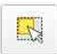</a>

3.   Se cerrara el cuadro de diálogo actual y el puntero cambiará a una cruz lo cual indica que ya esta listo para seleccionar el terreno, dar clic sobre el terreno a registrar.

<a class="" data-lightbox="Paso 3" href="../_static/tutorial/captura_y_estructura_de_datos/cap6UBA4.gif" title="Paso 3" data-title="Paso 3"></a>

4. Al seleccionar el predio reaparecerá el cuadro de diálogo inicial identificando los elementos a registrar, posteriormente se debe activar el botón crear

<a class="" data-lightbox="Paso 4" href="../_static/tutorial/captura_y_estructura_de_datos/cap6UBA5.png" title="Paso 4" data-title="Paso 4">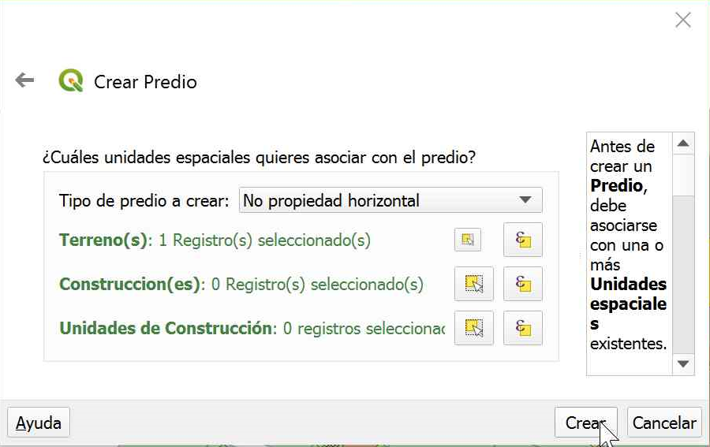</a>

5.  Se desplegará un formulario, el cual deberá ser diligenciado con la información ofrecida por la imagen de la seccion unidad basica administrativa, recuerde que los campos coloreados son obligatorios

<a class="" data-lightbox="Paso 5" href="../_static/tutorial/captura_y_estructura_de_datos/cap6UBA6.png" title="Paso 5" data-title="Paso 5">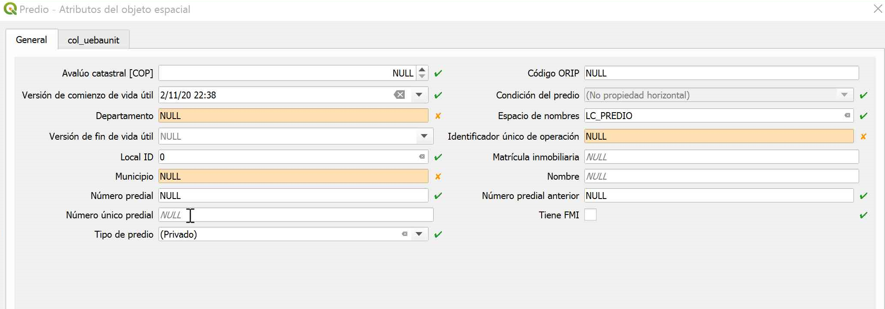</a>

6. El objetivo es que el formulario quede diligenciado tal cual como lo muestra la siguiente imagen y finalmente dar clic en el botón **Aceptar**

<a class="" data-lightbox="Paso 6" href="../_static/tutorial/captura_y_estructura_de_datos/cap6UBA7.png" title="Paso 6" data-title="Paso 6"></a>

## Interesados
Un predio siempre tiene asociado a una persona, a la cual llamaremos interesado puede ser natural o jurídico, inclusive puede ser un grupo de interesados, en esta sección se describirá como se debe registrar cada uno de estos, en su elaboración es necesario tener en cuenta la información de la siguiente imagen.

<a class="" data-lightbox="Información" href="../_static/tutorial/captura_y_estructura_de_datos/cap7interesados1.png" title="Información" data-title="Información"></a>

1.  Para iniciar el proceso diríjase al menú de opciones y siguiendo la siguiente ruta **LADM-COL – Captura Y Estructuración De Datos –Levantamiento Catastral – Interesado—Crear Interesado**

<a class="" data-lightbox="Paso 1" href="../_static/tutorial/captura_y_estructura_de_datos/cap7interesados2.png" title="Paso 1" data-title="Paso 1"></a>

2.  De inmediato se desplegará un cuadro de diálogo donde  permite dos maneras diferentes de ingresar este tipo de información, desde una capa de Qgis (definiendo un mapeo de campos), para este ejercicio se hará por medio de un formulario, seleccionar la opción y presionar   el botón **crear**

<a class="" data-lightbox="Paso 2" href="../_static/tutorial/captura_y_estructura_de_datos/cap7interesados3.png" title="Paso 2" data-title="Paso 2">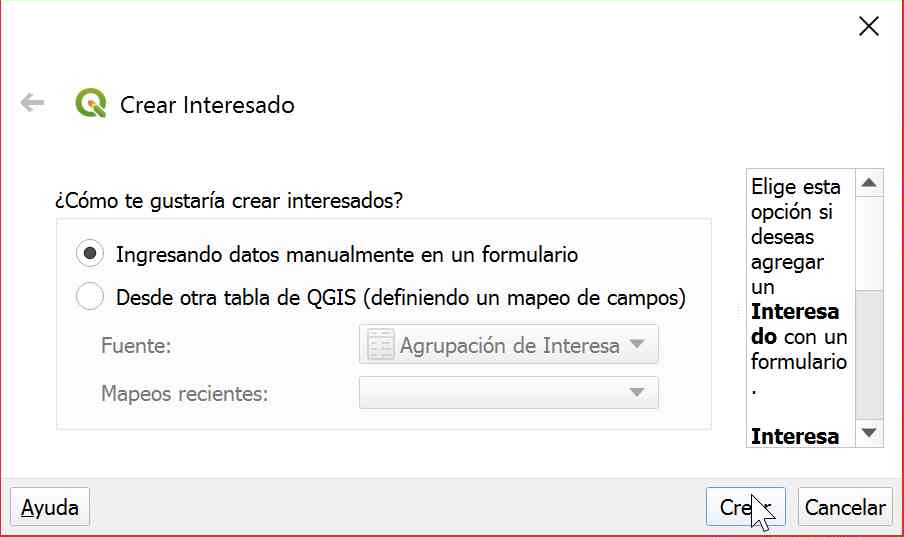</a>

3. Se desplegará un formulario, el cual deberá ser diligenciado con la información de la primera imagen de la seccion de interesados, recuerde que los campos coloreados son obligatorios.

<a class="" data-lightbox="Paso 3" href="../_static/tutorial/captura_y_estructura_de_datos/cap7interesados4.png" title="Paso 3" data-title="Paso 3">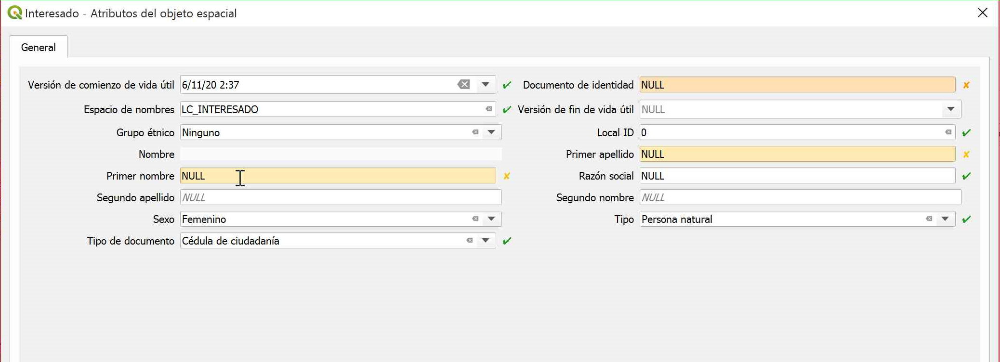</a>

4. El objetivo es que el formulario que pueda ser diligenciado tal cual como lo muestra la siguiente imagen y finalmente dar clic en el botón **Aceptar**

<a class="" data-lightbox="Paso 4" href="../_static/tutorial/captura_y_estructura_de_datos/cap7interesados5.png" title="Paso 4" data-title="Paso 4"></a>

### Crear Agrupación De Interesados
<div class="warning">
<p class="admonition-title">ADVERTENCIA</p>
<p>Antes de iniciar con este proceso, debe haberse creado todos los interesados presentes la primera imagen de la seccion de interesados.</p>
</div>

1.  Se iniciará el proceso dirigiéndose al menú de opciones, siguiendo la siguiente ruta **LADM-COL – Captura Y Estructuración De Datos –Levantamiento Catastral – Interesado—Crear Agrupación de Interesados**

<a class="" data-lightbox="Paso 1" href="../_static/tutorial/captura_y_estructura_de_datos/cap7interesados6.png" title="Paso 1" data-title="Paso 1"></a>

2. Teniendo en cuenta la información de la primera imagen de la seccion de interesados, añadimos el nombre y el tipo de agrupación, seleccionamos los 3 interesados creados y por medio del botón <a class="" data-lightbox='Botón "Trasladar a la derecha"' href="../_static/tutorial/captura_y_estructura_de_datos/ICOtrasladarderecha.png" title='Botón "Trasladar a la derecha"' data-title='Botón "Trasladar a la derecha"'>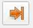</a>. los añadimos como los protagonistas de la agrupación

<a class="" data-lightbox="Paso 2" href="../_static/tutorial/captura_y_estructura_de_datos/cap7interesados7.png" title="Paso 2" data-title="Paso 2">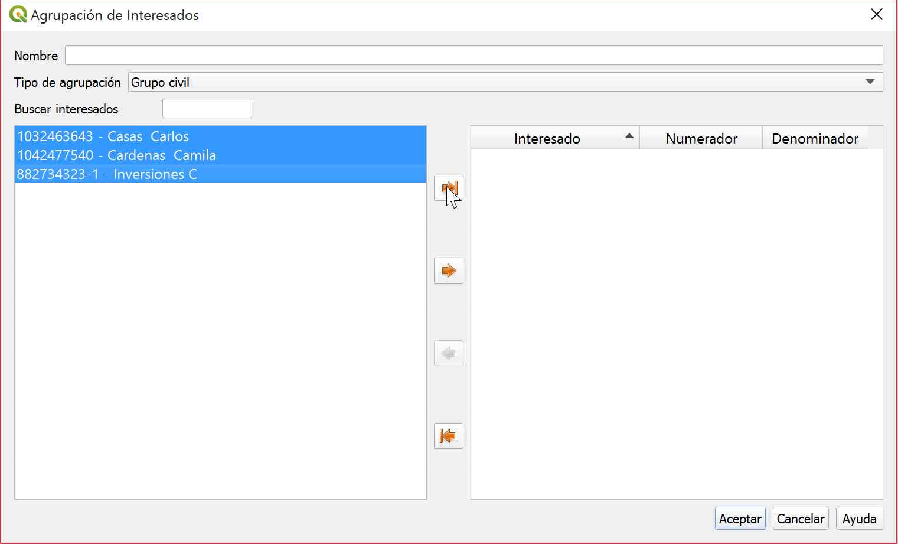</a>

3.  Por ultimo, se asignan los porcentajes de derecho sobre el predio, teniendo en cuenta la información la primera imagen de la seccion de interesados, es importante aclarar que todos ellos deben tener un valor de participación, al terminar la asignación se procede a dar clic en el botón **Aceptar.**

<a class="" data-lightbox="Paso 3" href="../_static/tutorial/captura_y_estructura_de_datos/cap7interesados8.png" title="Paso 3" data-title="Paso 3">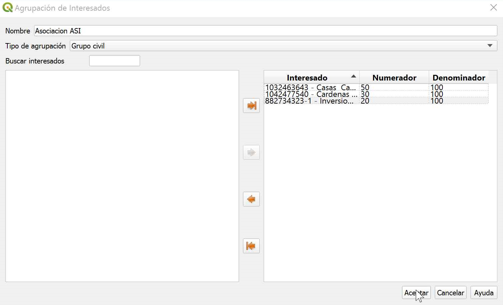</a>

## Fuentes
Las fuentes son los documentos de soporte tanto a nivel administrativo como técnico del predio, en esta sección se detallará como hacer la relación de este tipo de información y lo desarrollado hasta el momento , para ello es necesario tener en cuenta la información de la siguiente imagen.

<a class="" data-lightbox="Información" href="../_static/tutorial/captura_y_estructura_de_datos/cap8fuentes1.png" title="Información" data-title="Información"></a>

1. Para iniciar el proceso de relación es necesario, seguir la siguiente ruta **LADM-COL – Captura Y Estructuración De Datos – Levantamiento Catastral – Fuente—Crear Fuente Administrativa.**

<a class="" data-lightbox="Paso 1" href="../_static/tutorial/captura_y_estructura_de_datos/cap8fuentes2.png" title="Paso 1" data-title="Paso 1">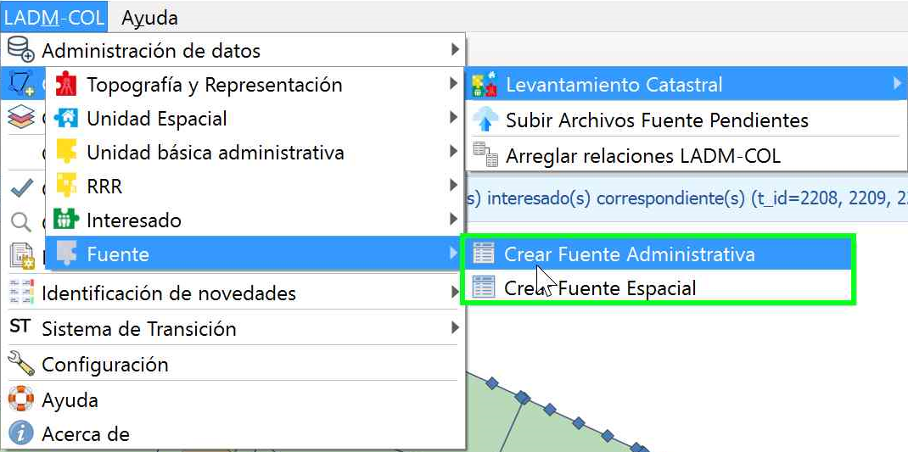</a>

2.  Se desplegará un cuadro de diálogo donde  permite dos maneras diferentes de ingresar este tipo de información, desde una capa de Qgis (definiendo un mapeo de campos), para este ejercicio se hará por medio de un formulario, seleccionar la opción y presionar el botón **crear**.

<a class="" data-lightbox="Paso 2" href="../_static/tutorial/captura_y_estructura_de_datos/cap8fuentes3.png" title="Paso 2" data-title="Paso 2"></a>

3. Se desplegará un formulario, el cual deberá ser diligenciado con la información de la primera imagen de esta sección, recuerde que los campos coloreados son obligatorios.

<a class="" data-lightbox="Paso 3" href="../_static/tutorial/captura_y_estructura_de_datos/cap8fuentes4.png" title="Paso 3" data-title="Paso 3">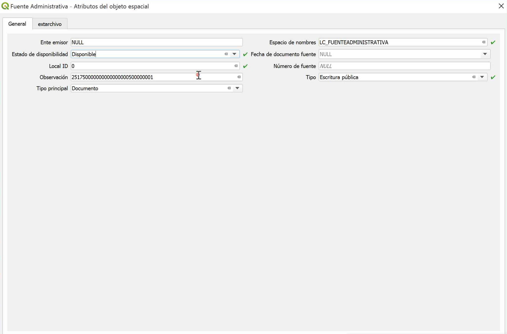</a>

4.  Se vinculará el archivo que será el soporte administrativo, elegir la pestaña **extrarchivo,** posteriormente se activa el botón edición <a class="" data-lightbox='Botón "Edición"' href="../_static/tutorial/captura_y_estructura_de_datos/ICOedicion.png" title='Botón "Edición"' data-title='Botón "Edición"'></a> 

<a class="" data-lightbox="Paso 4" href="../_static/tutorial/captura_y_estructura_de_datos/cap8fuentes5.png" title="Paso 4" data-title="Paso 4"></a>

5.  Se activará el botón añadir extrarchivo, se procede a dar clic en el botón que se encuentra cerca de la casilla **Datos**.

<a class="" data-lightbox="Paso 5" href="../_static/tutorial/captura_y_estructura_de_datos/cap8fuentes6.png" title="Paso 5" data-title="Paso 5">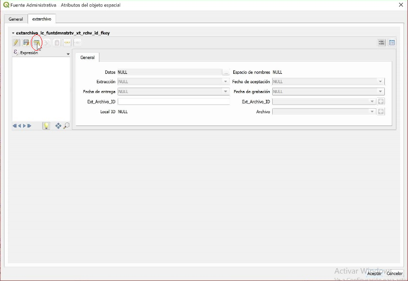</a>

6. Se abrirá un cuadro de diálogo, donde se podrá seleccionar el documento de soporte administrativo, después de seleccionado dar clic en el botón **abrir**.

<a class="" data-lightbox="Paso 6" href="../_static/tutorial/captura_y_estructura_de_datos/cap8fuentes5.png" title="Paso 6" data-title="Paso 6"></a>

7. Como se puede apreciar en la ventana, el archivo ya ha sido cargado y además ya se le fue asignado un número de identificación, se procede a dar clic en **Aceptar**

<a class="" data-lightbox="Paso 7" href="../_static/tutorial/captura_y_estructura_de_datos/cap8fuentes7.png" title="Paso 7" data-title="Paso 7"></a>

Finalmente se repite el proceso, teniendo en cuenta la información consignada en la imagen inicial de la seccion **Fuentes**, guardar los cambios de edición, si se quiere ver el resultado de este proceso, dirigirse a la tabla de Fuente administrativa, y consultar su información tal cual como lo muestra la siguiente imagen.

<a class="" data-lightbox="Paso 7" href="../_static/tutorial/captura_y_estructura_de_datos/cap8fuentes8.gif" title="Paso 7" data-title="Paso 7">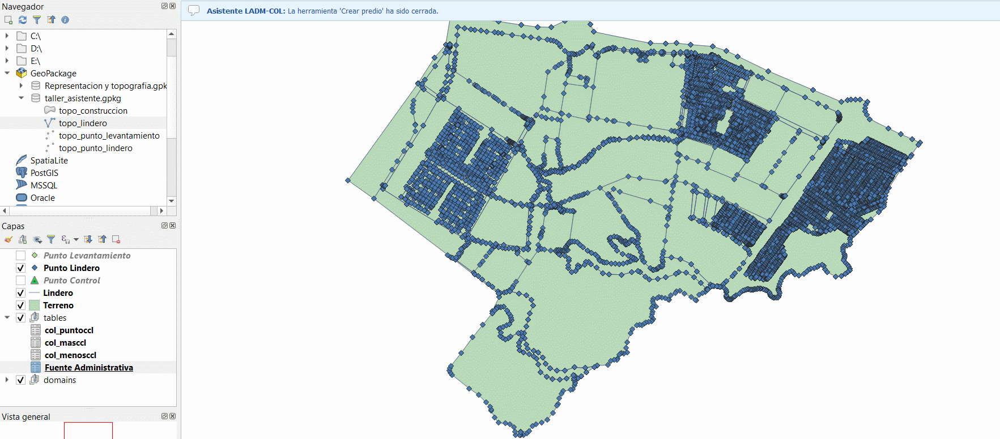</a>

## RRR

### Crear Derecho
Se creará el derecho de dominio, para ello se necesita un documento de soporte, identificado como nuestra fuente, el cual también ya ha sido creada. Por lo tanto, lo único que se necesita es crear la relación, para su construcción es necesario tener en cuenta la información de la siguiente imagen.

<a class="" data-lightbox="Información" href="../_static/tutorial/captura_y_estructura_de_datos/cap9derechos1.png" title="Información" data-title="Paso 7"></a>

1. Dirigase a la tabla de atributos de la tabla fuente administrativa, y seleccionar la fila correspondiente con la información del predio, para ello es posible apoyarse en la ultima imagen de la seccion de Fuentes.

2. Para continuar con el proceso de relación es necesario, seguir la siguiente ruta **LADM-COL – Captura Y Estructuración De Datos – Levantamiento Catastral – RRR—Crear Derecho.**

<a class="" data-lightbox="Paso 2" href="../_static/tutorial/captura_y_estructura_de_datos/cap9derechos2.png" title="Paso 2" data-title="Paso 2">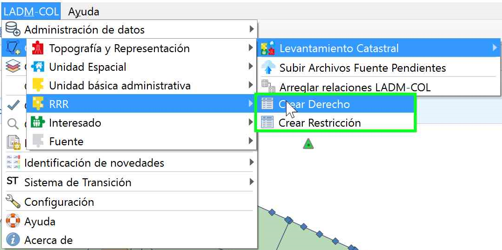</a>

3.  Se desplegará un cuadro de diálogo donde nos permite dos maneras diferentes de ingresar este tipo de información, desde una capa de Qgis (definiendo un mapeo de campos), o por medio de un formulario. Para este ejercicio se hará por medio de un formulario, seleccionar la opción y presionar el botón **siguiente** , al haberse realizado el paso 1 , ya se puede visualizar una fuente administrativa seleccionada por lo tanto se procede a dar clic en el botón **crear**

<a class="" data-lightbox="Paso 3" href="../_static/tutorial/captura_y_estructura_de_datos/cap9derechos3.gif" title="Paso 3" data-title="Paso 3"></a>

4. El objetivo es que el formulario quede diligenciado tal cual como lo muestra la siguiente imagen, para ello se puede basar en la imagen inicial de esta seccion y finalmente dar clic en el botón **Aceptar**

<a class="" data-lightbox="Paso 4" href="../_static/tutorial/captura_y_estructura_de_datos/cap9derechos4.png" title="Paso4" data-title="Paso 4"></a>


