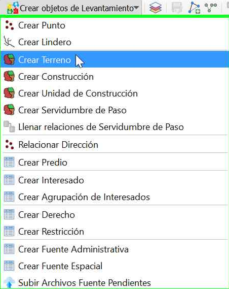
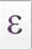
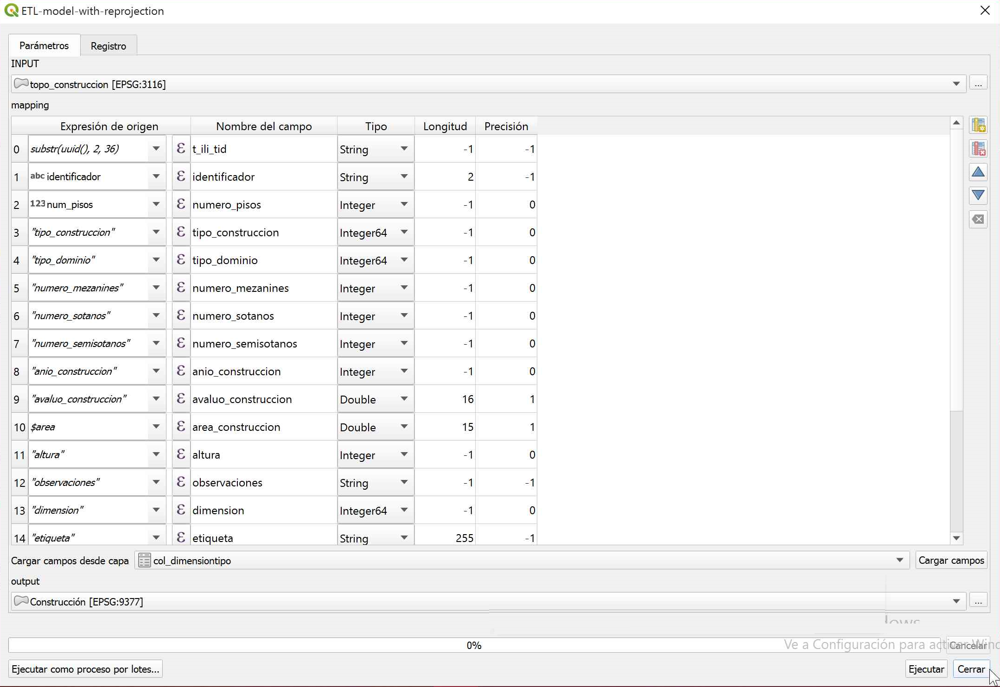

# Captura y Estructuración de Datos

## Preprocesamiento de insumos

## Consulta de dominios

## Paquete de topografía y representación

### Puntos de lindero

### Puntos de levantamiento

### Puntos de Control

### Linderos

### Construcción De Linderos

### Relación Entre Puntos y Linderos

## Unidad Espacial

### Terrenos

#### Paso 1: Creación de terreno

Dirigete al botón  `Crear objetos de Levantamiento` (ubicado en la barra de herramientas) y selecciona la opción **Crear Terreno**:

#### Paso 2: Selección de linderos

Se desplegará un cuadro de diálogo, donde tienes la opción de cargar una capa vectorial con la información o generar el terreno a partir de los linderos existentes. En este caso, se procede a elegir la opción **Seleccionando linderos existentes** y luego das clic en el botón **Siguiente**. Posteriormente, das clic en la opción *"Seleccionar todos los linderos"* (última opción):

TIP

En el cuadro de diálogo que se despliega, encuentras tres opciones que corresponden con: 
<ol>
  <li><b>1.</b> Seleccionar lindero(s) en el mapa.</li>
  <li><b>2.</b> Seleccionar lindero(s) con base en una expresión.</li>
  <li><b>3.</b> Seleccionar todos los linderos.
</li>
</ol>

#### Paso 3: Cálculo área del terreno

Una vez que los terrenos han sido creados, es necesario calcular o en su defecto actualizar el área del terreno. Para ello, debes dar clic en el botón `Abrir tabla de atributos` ubicado en la parte superior de la barra de tareas. Posteriormente elegir en el menú desplegable del lado izquierdo el atributo **Área de terreno [m2]** y das clic en el botón *Generar expresión* , de esta forma se despliega la ventana de *"Diálogo de expresiones"*, en la cual debes emplear la función *\$area*. Luego, basta con dar clic en el botón **Aceptar**. 

Finalmente, al cerrar la ventana emergente debes dar clic en el botón **Actualizar todo**, de inmediato podrás ver que en la columna **Área de terreno** se asignaron los valores de área correspondiente. Para guardar dichos cambios presiona el botón *Guardar edición* , luego, puedes cerrar la ventana.

 
### Relación entre Linderos y Terrenos

#### Paso 1: Creación de la relación

El diligenciamiento de esta relación se realiza con la herramienta ``Llenar más CCL y menos`` ubicada en la barra de herramientas. Al hacer click en este botón, emergerá un cuadro de diálogo preguntandóte si deseas ejecutar esta acción para todos los terrenos identificados en la base de datos. En este caso, se procede a dar clic en el botón ``Sí``.

#### Paso 2: Verificación de la relación

Para verificar el estado de las relaciones creadas previamente, basta con abrir la tabla de atributos de la tabla **Col_masccl**, y en la columna *col_mas* corroborar si los campos están diligenciados correctamente. 

### Construcciones

#### Paso 1: Creación de construcción

Al desplegar el menú del botón `Crear objetos de Levantamiento` (ubicado en la barra de herramientas) debes seleccionar la opción **Crear Construcción**. Esta acción abrirá una ventana en la cual se te consulta *¿Cómo te gustaría crear construcciones?*, allí puedes seleccionar entre dos opciones: digitalizando ó importando la información desde una capa vectorial.

En este caso, harás uso de la información registrada en la capa **topo_construcciones**. De manera que luego de definir la fuente mencionada, debes dar clic en el botón `Importar`.

#### Paso 2: Creación de construcción

De inmediato, se desplegará la ventana de mapeo de campos, en la cual debes realizar las modificaciones correspondientes hasta obtener un muestreo como el de la siguiente imagen:

Se recomienda tener en cuenta los pasos desarrollados en el [paso 4](#paso-4-mapeo-de-campos-punto-lindero) de la sección de punto de lindero, considerando:   

| Atributo                 | Expresión                                                    |
| ------------------------ | ------------------------------------------------------------ |
| REVISAR   | nombre                                                       |
| puntotipo                | get_domain_code_from_value('lc_puntotipo', punto_tipo,True, False) |
| tipo_punto_control       | get_domain_code_from_value('lc_puntocontroltipo', "Control",True, False) |
| exactitud_horizontal     | 1                                                            |
| exactitud_vertical       | 1                                                            |
| metodoproduccion         | get_domain_code_from_value('col_metodoproducciontipo', 'Metodo_Directo',True, False) |

Después de completar dichas modificaciones, puedes emplear la acción del botón ``Ejecutar``, y verificar el mensaje del proceso, luego, puedes **Cerrar** la ventana.

### Unidades De Construcción

#### Paso 1: Creación de unidad de construcción

Para iniciar con el proceso de crear las unidades de construcción se debe emplear la herramienta **Identificar**, ubicada en la barra de herramientas de QGIS. 

Con el propósito de extraer el valor **t_id** asignado al polígono que representa la construcción de interés.

1.  Después de tener los t_id se procede con el proceso de creación de las unidades de construcción,  para ello dirigirse al menú de opciones, y seleccionar la siguiente ruta **LADM-COL – Captura Y Estructuración De Datos – Levantamiento Catastral – Unidad Espacial—Crear Unidad De Construcción**

2.  De inmediato se desplegará un cuadro de diálogo solicitando como se pretende generar la unidad de construcción si por una capa vectorial o digitalizándolo, en este caso lo haremos digitalizando, posteriormente se da clic en el botón **crear**

3. Al cerrarse la ventana se activará el snapping, el cual ayudará con el proceso de digitalización,  apoyándose de los puntos levantamiento para definir la unidad de construcción, una vez termine de vectorizar el polígono correspondiente dar clic derecho, al hacerlo el polígono tendrá un contorno sombreado y abrirá un formulario.

Al finalizar el polígono se abre un formulario, el cual tiene resaltado unas casillas en un color melocotón, estas casillas indican que deben llenarse de forma obligatoria, ahorrando trabajo en el momento de consultar los datos obligatorios en el modelo, en la sección **lc_construccion** diligenciar el **t_id** de la construcción consultada previamente.

TIP

se recomienda llenar el formulario con los datos que se pueden visualizar en la siguiente imagen, una vez terminado de diligenciar el formulario dar clic en el botón **aceptar**

Finalmente, se cerrará el cuadro de diálogo y se podrá visualizar un sólido en 3D que representa la construcción.

## Unidad Básica Administrativa

### Crear Predio

## Interesados

### Crear Agrupación De Interesados

## Fuentes

## RRR

### Crear Derecho