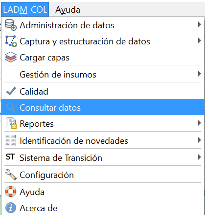
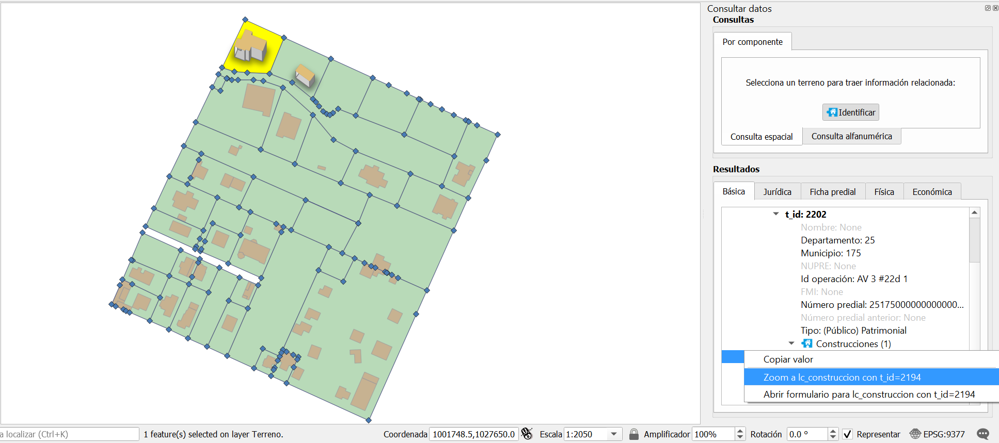
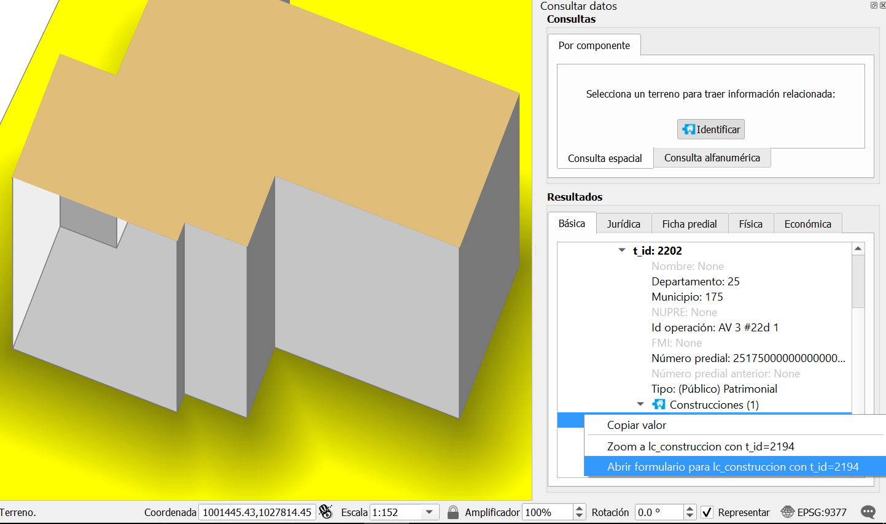
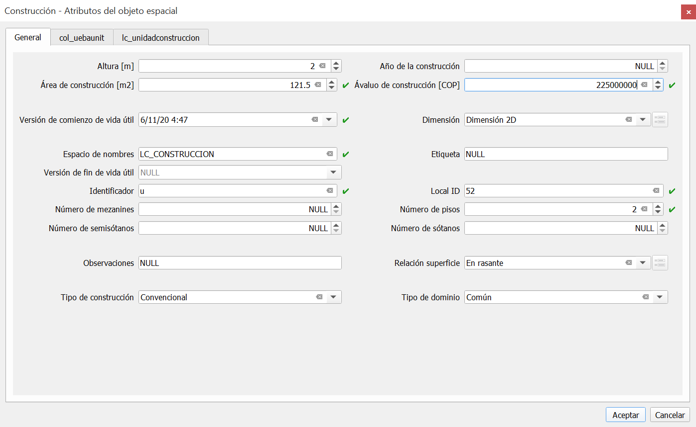
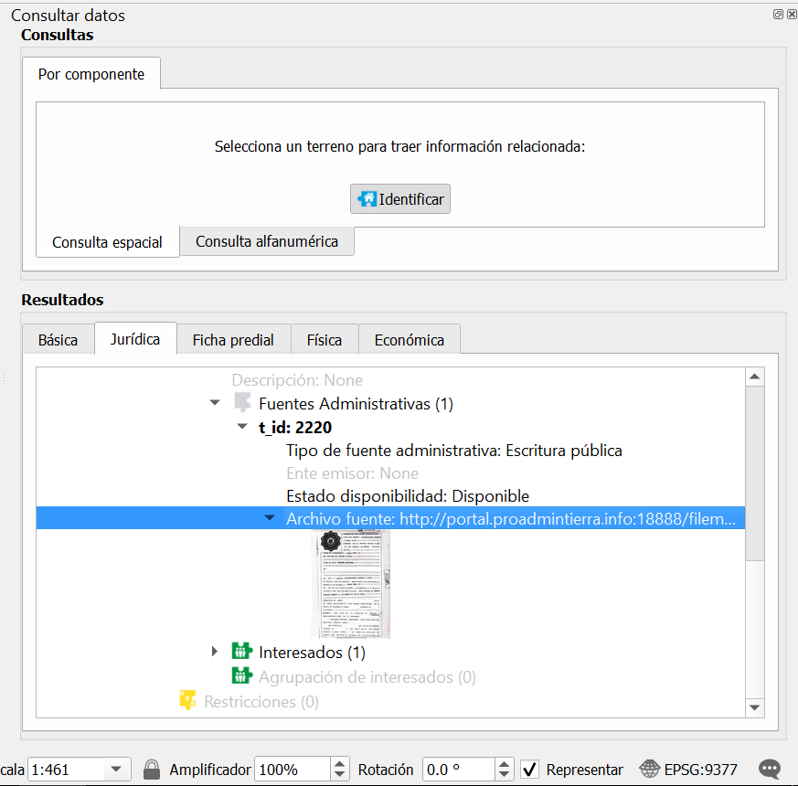
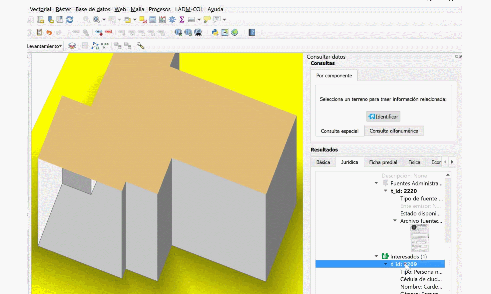
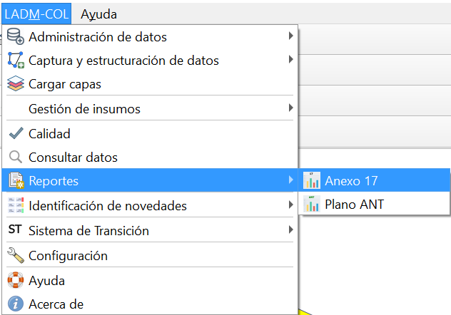

# Consulta de Información
Este módulo cuenta con un total de 5 consultas definidas por el IGAC, bajo la estructura del modelo LADM-Col. Permitiendo hacer una validación temática de la información para la edición de los datos en caso de encontrar algún error.

Las consultas existentes son: la básica, la jurídica, ficha predial, física y económica.

1.  Para acceder a esta funcionalidad es necesario seguir la ruta **LADM-COL –Consulta de datos**

Obtendrá un panel de navegación a la derecha, que permite identificar y hacer cualquiera de las consultas anteriormente mencionadas.

2.  Para Iniciar con el proceso, presionar el botón Identificar y dar clic sobre el terreno que se desea consultar, en este caso queremos obtener información de una construcción , así que haciendo uso del nuevo panel de navegación, se ubicará la sección de unidad espacial y sobre el atributo **t_id**. Dar clic derecho y elegir la opción **zoom_lc construccion con t_id= xx numero.**

3. Automaticamente se acercará al predio consultado, sobre el atributo **t_id** dar clic derecho y seleccionar la opción **Abrir formulario para lc_unidadconstruccion con t id = xx numero.**

4. Se desplegará una ventana con toda la información física del predio, es importante recordar que estamos situados en la pestaña de consulta básica, aquí se tiene la posibilidad de hacer cambios con el fin de actualizar la información o corregir un error, en tal caso de haber efectuado una corrección dar clic en el botón **Aceptar.**

5. En caso que se quiera hacer otro tipo de consulta, es posible moverse a cualquiera de las otras pestañas existentes, por ejemplo la **Jurídica,** queremos conocer los documentos que soportan el derecho de propiedad, por lo tanto se debe desplegar cada una de las pestañas relacionadas al **t\_id:** xx número de
la sección de fuentes administrativas, y dar clic sobre la imagen que representa el documento, en ese momento se inicia un proceso de descarga del archivo solicitado, que podrá ver en su carpeta de descargas.

Este mismo proceso es el que se aplica para las demás consultas establecidas por el asistente.

# Generación de Reportes 

EL asistente LADM-Col actualmente genera dos tipos de reportes, un reporte de colindancia conocido como el Anexo 17 y un documento solicitado por la Agencia Nacional de Tierras llamado plano ANT.

1.  Para acceder a estos reportes , primero es necesario seleccionar el predio del cual se desea dicho reporte, posteriormente accedemos a la siguiente ruta **LADM-COL – Reportes—Anexo 17 o Plano ANT según se requiera.**

2. Se abrirá un cuadro de diálogo solicitando la dirección donde se guardará el archivo, una vez decidido dar clic en el botón **seleccionar carpeta.** 

Para consultar el archivo puede dirigirse a dicha carpeta y encontrar un archivo muy similar al que se puede apreciar en la Última imagen.

