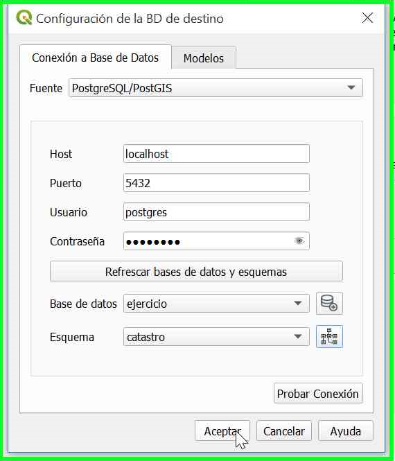

# Crear Estructura LADM-COL

1. Para configurar el asistente se debe asignar el modelo conceptual, el cual será la base para el desarrollo de operaciones, que ayuden de forma organizada en el registro y recopilación de información, para ello es necesario ir al menú de opciones y seleccionar el asistente **LADM-COL,** luego ir **administración de datos** y finalmente en **crear estructura LADM-COL.**
    
    

2. Posteriormente se procede a configurar la base de datos donde se almacenará toda la información  registrada por el usuario. Para ello seleccionar el botón “**configurar conexión**

    

3. Inmediatamente el cuadro de diálogo cambiara solicitando los datos necesarios para desarrollar una conexión a cualquiera de los siguientes gestores de base de datos :

     -   PostgresSQL/PostGis

     -   Geopackage

     -   MS SQL Server

     Los datos necesarios para lograr la conexión son:

     -   Host: localhost

     -   Puerto: 5432

     -   Usuario: Postgres

     -   Contraseña: (definida por el usuario al momento de instalar postgres)

    Como ejemplo usamos los datos de conexión de una base de datos de PostgresSQL.
    
     

4.  Ahora es necesario crear una base de datos y un esquema el cual agrupará toda la información trabajada por el asistente, para ello es necesario activar el botón **Refrescar bases de datos y esquemas**

     

5.  Para la creación de la base de datos presionar el icono  de inmediato saldrá un cuadro de diálogo solicitando el nombre a asignar, posterior a ello se deberá activar el botón **Crear database** y después de ver el mensaje de verificación de dicho proceso finalmente dar clic en el botón **Cerrar.**

    
     
     
      

6.  Para la creación del esquema presionar el icono   saldrá un cuadro de diálogosolicitando el nombre a asignar, posterior a ello se deberá activar el botón **Crear Shema,** se procede a dar clic en el botón **Aceptar**

     
     
     
    
7.  Finalmente volverá al cuadro de diálogo inicial con un mensaje de verificación del proceso realizado, presionar el botón Cerrar para continuar con el proceso.

     

