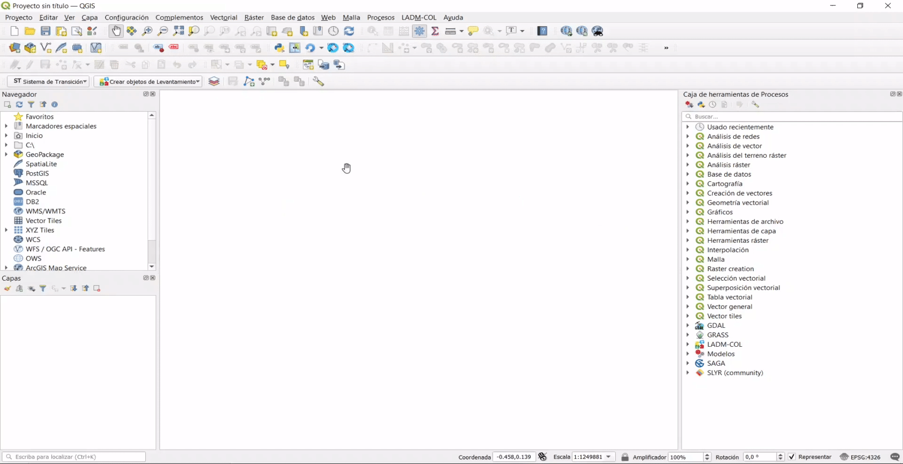
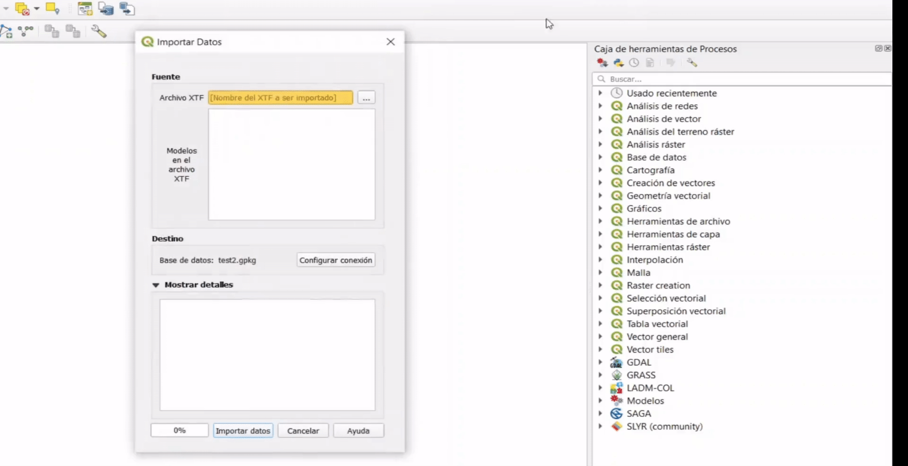

# Exportar e Importar Datos

En esta sección se describe el procedimiento que se debe seguir para la exportación e importación de la información generada en el modelo de levantamiento catastral a lo largo de este tutorial.

## Exportar datos

### Paso 1: Menú de Exportar Datos.

Para iniciar el proceso, se debe seguir la ruta **Administración de Datos -> Exportar Datos**. Esta acción despliega un cuadro de diálogo dividido en tres (3) secciones:

- Fuente
- Destino
- Mostrar detalles

### Paso 2: Selección de la Fuente.

En primera medida, se debe validar que la *Base de datos* a la cual se hace referencia corresponde al archivo que se desea exportar en el formato de intercambio **.xtf**. 

En caso de que ésta no sea correcta, puedes cambiar la conexión dando clic en `Configurar conexión`.

TIP

En la interfaz que se despliega al dar clic en <code class="docutils literal notranslate">Configurar conexión</code>, es posible deshabilitar las validaciones ingresando a la pestaña <b>Modelos</b> y seleccionando la casilla de verificación de <i>Validar datos cuando se importa o exporta un archivo XTF</i>.

### Paso 3: Exportar XTF.

En la sección *Destino*, en el campo de *Archivo XTF* debes dar clic en el botón `...`, con esta acción procedes a definir la carpeta y el nombre del archivo *.xtf* a exportar, luego das clic en `Guardar` y finalmente en el botón `Exportar datos`. 

### Paso 4: Verificación de la creación del XTF.

Una vez que termine el proceso de *Exportar Datos*, das clic en el botón `Cerrar` y verificas que el XTF se encuentre en la carpeta especificada.

## Importar datos

### Paso 1: Menú de Importar Datos.

Para iniciar el proceso, se debe seguir la ruta **Administración de Datos -> Importar Datos**. Esta acción despliega un cuadro de diálogo dividido en tres (3) secciones:

- Fuente
- Destino
- Mostrar detalles

### Paso 2: Selección de la Fuente.

En primera medida debes validar que el *Archivo XTF* que se va a importar sea el de tu interés. En caso de que desees modificarlo basta con cambiar la ruta del archivo *.xtf* dando clic en `...`.

### Paso 3: Importar XTF.

En la sección de *Destino* debes verificar que la conexión sobre la cual se va a importar la información del archivo *.xtf* (seleccionado previamente) sea correcta. En caso contrario, debes modificar la conexión dando clic en el botón `Configurar conexión` y seleccionar la base de datos a la cual se desea importar la información. Una vez que termines de configurar la conexión debes dar clic en el botón `Importar datos`.

Al finalizar la importación aparecerá un aviso de confirmación en la ventana de *Importar Datos*, luego de su validación podrás dar clic en el botón `Cerrar`.