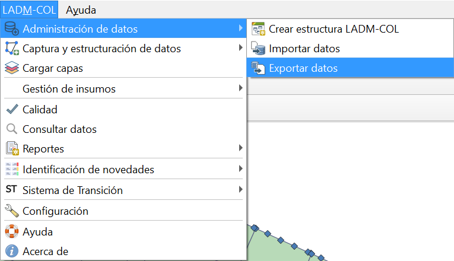
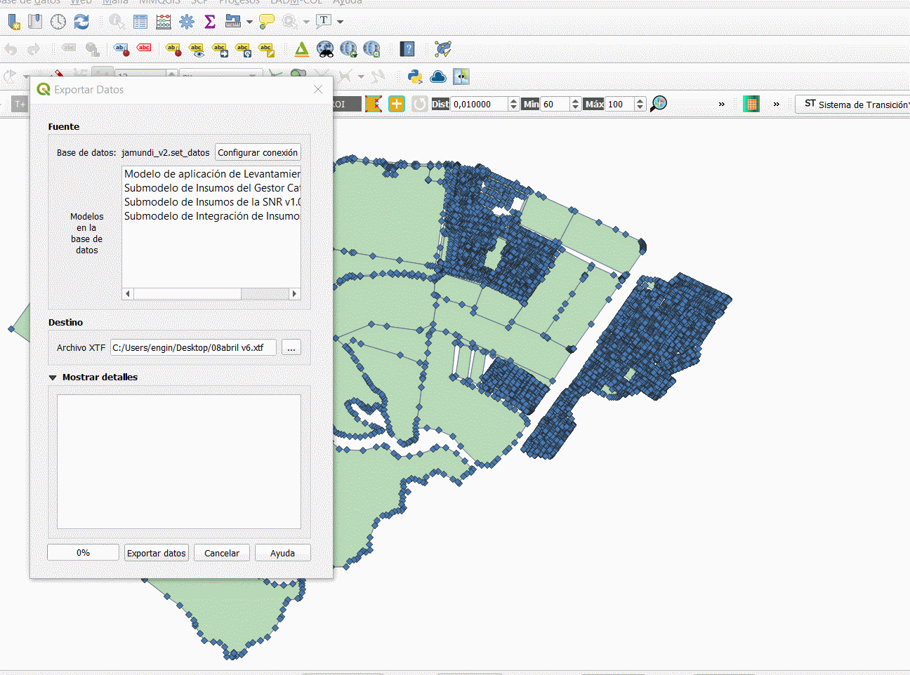
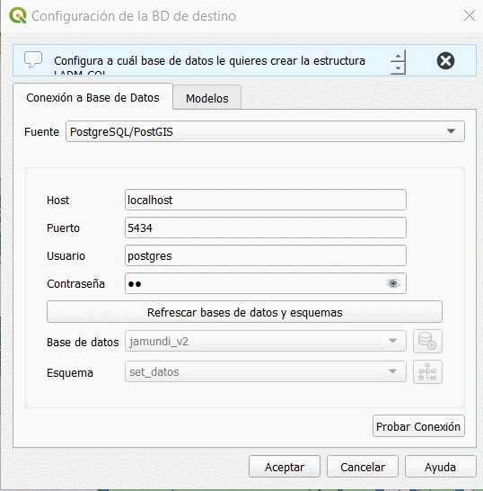
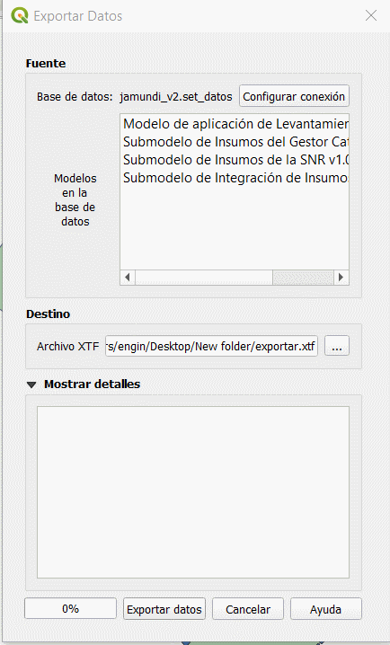
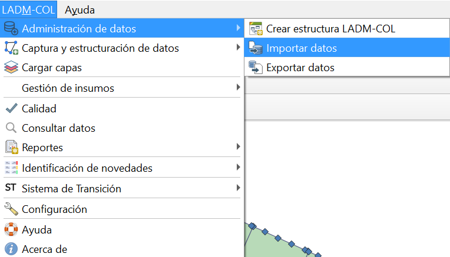
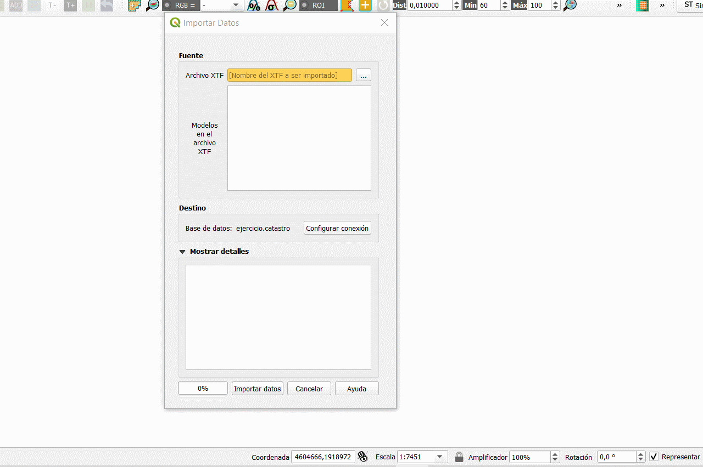

# Exportar e Importar Datos
Es importante hacer énfasis, en la interoperabilidad que ofrece el uso de los archivos \*.xtf , ya que programas como postgres permiten exportar archivos en dicho formato y ser acogidos por otros gestores de base de datos como el Geopackages, es decir que todos los procesos mencionados en cada uno de las secciones se pueden guardar en único archivo, permitiendo consolidar toda la información.
## Exportar datos
1.  Para iniciar el proceso, se debe seguir la ruta **Administración de Datos -- Exportar Datos**

2. Se abrirá un cuadro de diálogo, donde se localiza una casilla de color naranja que posee un botón el cual se debe activar para localizar la ruta donde se guardará la base de datos que contiene toda la información construida.

3. Al presionar el botón guardar, se cerrara la ventana emergente quedando aun la ventana de exportar datos, presionar el botón **configurar conexión,**  desspplegando otra ventana donde se dará clic en la pestaña modelos, ofreciendo la posibilidad de exportar los datos sin necesidad de validar la información, desactivando la casilla **validar datos cuando se importa o exporta un archivo \*.xtf** y posteriormente dar clic en el botón
**Aceptar**

4. Por último dar clic en el botón exportar datos después de generarse la notificación del proceso ejecutado, dar clic el botón cerrar.

## Importar datos

1. Para iniciar el proceso, seguir la ruta **Administración de Datos --Importar Datos**

2.  Se abrirá un cuadro de diálogo, donde se localiza una casilla de color naranja que posee un botón el cual se debe activar para localizar la ruta donde se guardó.

3.  Cuando se ubique el archivo, dar clic en **abrir** posteriormente en **importar datos** y finalmente dar clic en el botón **cerrar**

