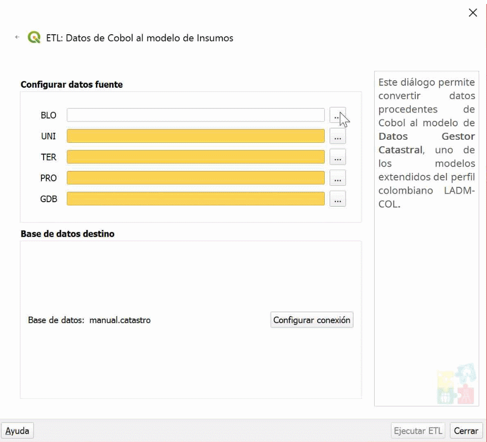
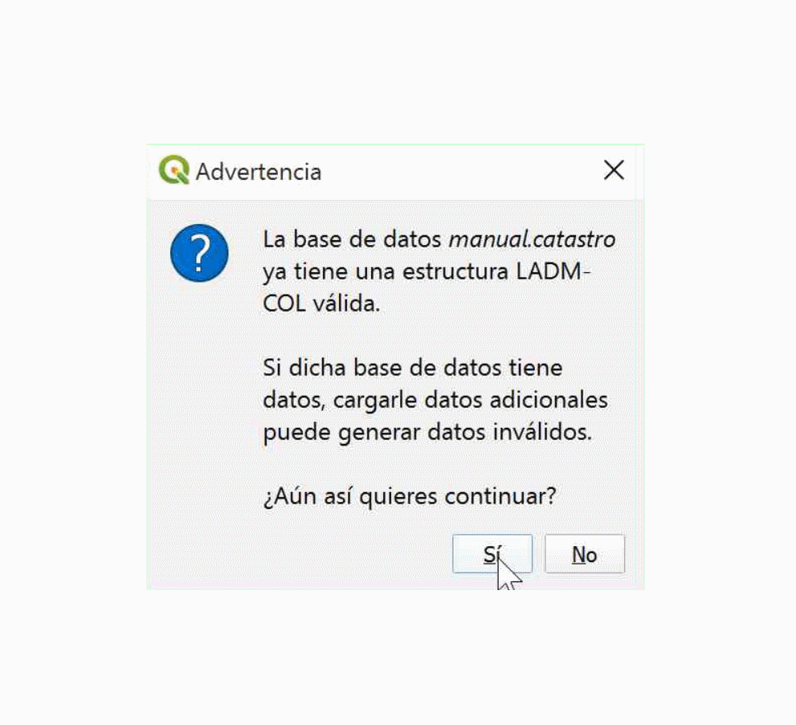
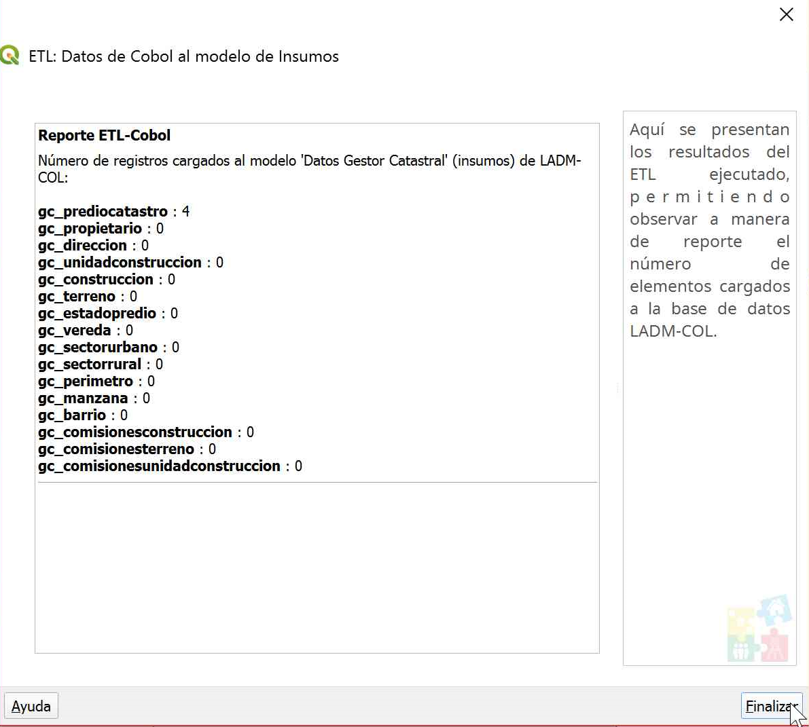
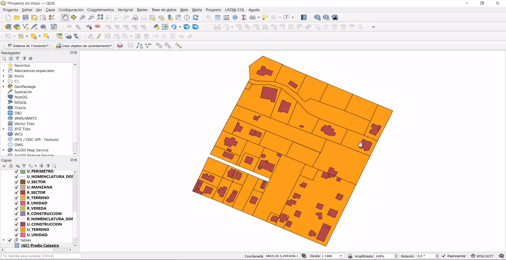
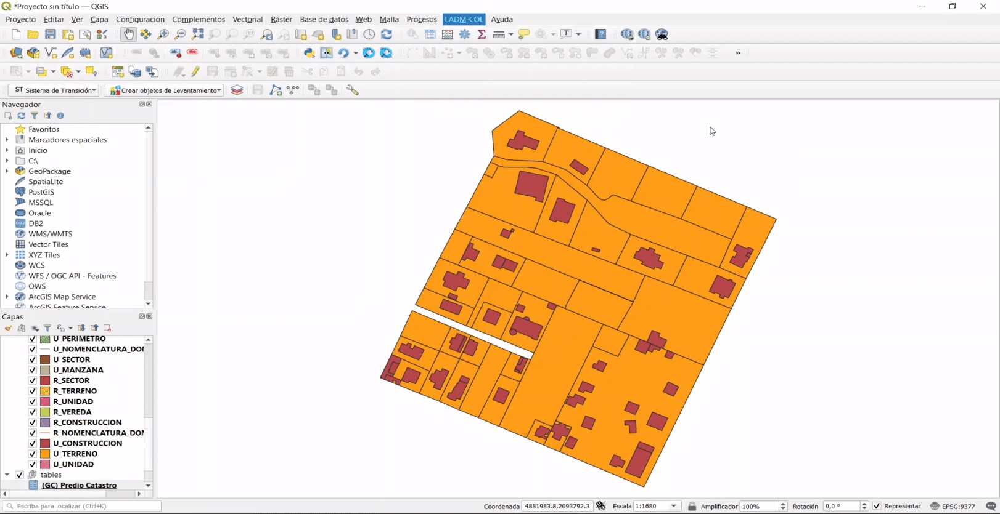
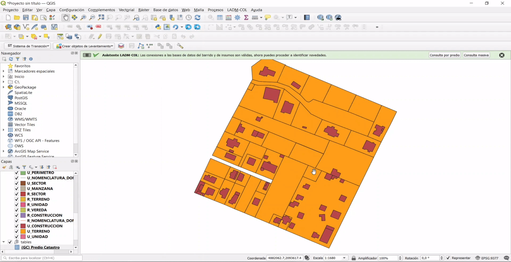
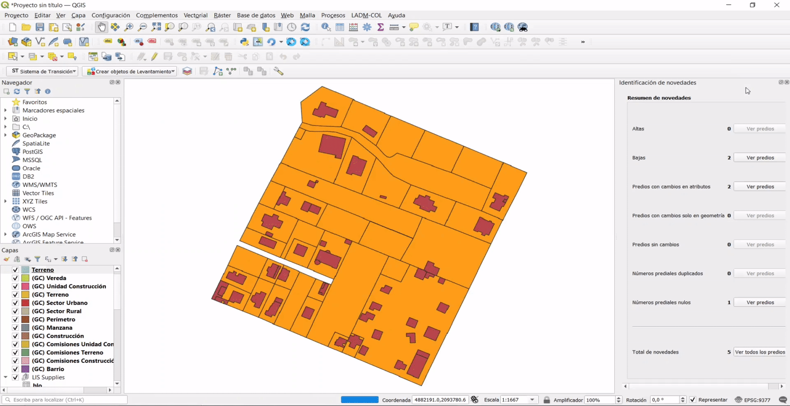

# Gestión de Insumos

## Ejecutar ETL de insumos COBOL

Esta sección tiene por objetivo ejecutar la *ETL de COBOL* para transferir los datos en la estructura de COBOL a la estructura del submodelo de insumos de levantamiento catastral.

TIP

El acrónimo <b>ETL</b> corresponde a <i>"Extract, Transform and Load"</i> (Extraer, Transformar y Cargar). Es ampliamente usado para describir los procesos que se llevan a cabo para migrar datos.

### Paso 1: Abrir ETL de insumos

Para iniciar con el proceso debes dirigirte a la siguiente ruta **LADM-COL -->  Gestión de Insumos --> Ejecutar ETL de Insumos**.

### Paso 2: Seleccionar ETL para datos de COBOL

Se despliega una interfaz en la cual debes seccionar la opción *ETL para datos COBOL* y dar clic en el botón `Siguiente`.

### Paso 3: Seleccionar archivos para ejecutar la ETL para datos COBOL

En la ventana que se despliega se habilitan las opciones para configurar los datos fuente (cargar los datos de COBOL). Debes cargar cada uno de los archivos de extensión **.lis** que se encuentra en los datos proporcionados al inicio del tutorial y el archivo de extensión **.gdb** en el último recuadro. Una vez que estén cargados los archivos, se habilita el botón `Ejecutar ETL`.

### Paso 4: Ejecutar ETL para datos de COBOL

Al dar clic en el botón `Ejecutar ETL` se despliega un cuadro de diálogo en el que se te advierte que si la base de datos que seleccionaste ya tiene datos, podrían generarse datos inválidos al importarle datos nuevos. Si tu base de datos aún no tiene datos, puedes continuar con la operación dando clic en el botón **Sí**. Una vez que la ETL finalice su ejecución, debes dar clic en el botón `Siguiente`.

### Paso 5: Resultados de la ETL para datos Cobol

Finalmente, se despliega un cuadro de diálogo donde se muestra el resultado de la ejecución de la ETL, listando las tablas principales del submodelo de insumos y el número de registros que se cargaron en cada una de esas tablas. Haz clic en el botón `Finalizar` para terminar el proceso.

## Identificación de novedades

### Paso 1: Configurar identificación de novedades

Para iniciar con el proceso debes dirigirte a la siguiente ruta **LADM-COL --> Identificación de novedades --> Configurar identificación de novedades**.

### Paso 2: Configuración de conexiones

Considerando que todo el proceso a lo largo de este tutorial se ha desarrollado en una única base de datos, se debe seleccionar la misma base de datos para **Barrido predial** y para **Insumos**. Tan pronto hayas seleccionado la misma base de datos, haz clic en `Aceptar`, lo que genera un mensaje de confirmación que informa que el proceso fue ejecutado con éxito.

### Paso 3: Abrir consulta masiva

Para la identificación de novedades es necesario hacer clic en el botón `Consulta masiva`, bien sea desde el mensaje de confirmación que se desplegó luego de realizar el paso anterior o desde el menú **LADM-COL --> Identificación de novedades --> Consulta masiva**.

### Paso 4: Resultado consulta masiva

Se obtiene un resumen de novedades que corresponde a una comparación de los datos de Levantamiento Catastral contra los datos de Insumos. El resumen indica el número de novedades encontradas agrupadas por tipo de novedad.

Finalmente, en el panel de Identificación de Novedades, haz clic en el botón `Ver predios` de cualquiera de los tipos de novedad habilitados y selecciona un predio para ver las diferencias entre un predio en el submodelo de Insumos y el mismo predio en el modelo de aplicación Levantamiento Catastral.

