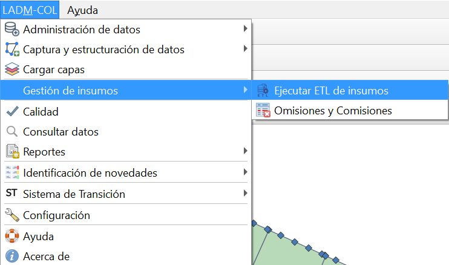
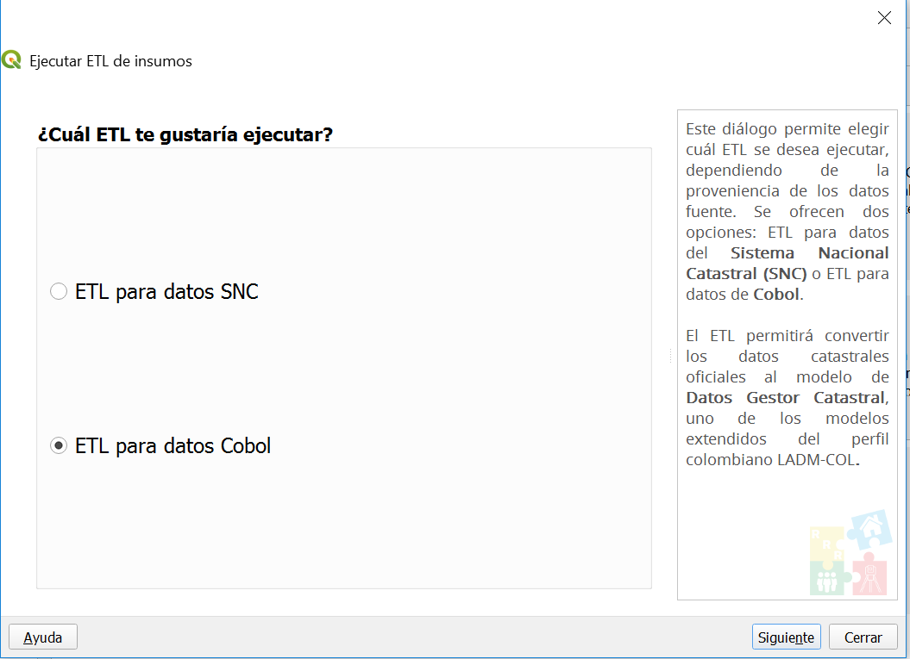
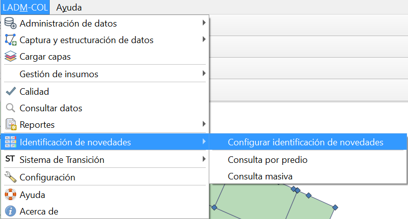
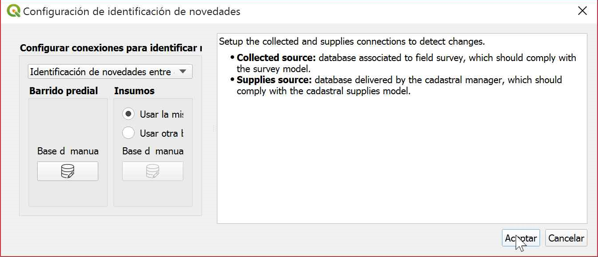
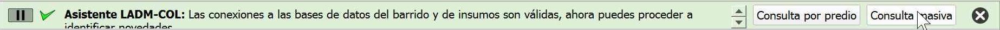
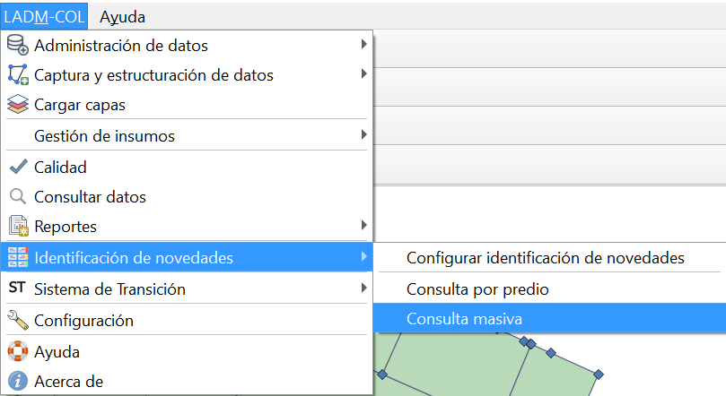

# Gestión de Insumos
La gestión de insumos esta pensado para los gestores catastrales que cuentan con datos para los operadores pero no están estructurados según el modelo LADM, para ello se hará uso de los datos cobol, compuestos por una geodatabase y unos archivos.\*lis, para que el operador haga uso de los **ETLs** correspondientes, y logre migrar esa información al modelo LADM-Col.

TIP

La palabra ETL corresponde a las siglas en inglés de Extraer: extract.,Transformar: transform.Y Cargar: load. Con ello, queremos decir que todo proceso ETL consta precisamente de estas tres fases: extracción, transformación y carga. Vamos a definir en qué consisten cada una de estas fases.

1.  Para iniciar con el proceso diríjase a la siguiente ruta **LADM-Col—Gestión de Insumos – Ejecutar ETL de Insumos**

2.  Se desplegará una opción solicitando conocer que ETLs se van a ejecutar, para este ejercicio se trabajaran con archivos cobol por lo tanto se debe seleccionar la opción ETL para datos cobol y dar clic en el botón **siguiente**

3. Abriendo un cuadro de diálogo donde dará clic en los botones que acompañan a cada una de las casillas, y podrán cargar cada uno de los archivos. lis y la geodatabase proporcionada por el gestor catastral, una vez cargada toda la información dar clic en **ejecutar ETL**

4.  Surgirá un cuadro de diálogo, consultando si se desea o no continuar con la operación , se procede a dar clic en **SI ,** desencadenando el proceso, finalmente cuando este
termine saldrá un mensaje de finalización , dar clic en el botón **siguiente**

5.  Finalmente se despliega un cuadro de diálogo donde se muestra el numero de datos cargados y finalmente se procede a dar clic en el botón **finalizar**

## Cargar insumos del gestor catastral

1. Para iniciar con la carga de los insumos cobol, iniciaremos dando clic en el botón ,  conocido como  **cargar capas**.

2.  Se desplegará un cuadro de diálogo donde podremos cargar todas las capas provenientes del *submodelo de insumos del Gestor Catastral*, seleccionarlas y dar clic en el botón **Aceptar**

## Identificación de novedades
Esta es una herramienta pensada para identificar cambios, del barrido predial masivo, con los datos entregados por el gestor catastral.

1.   Para iniciar con el proceso es necesario seguir la siguiente ruta **LADM-Col—identificación de novedades—configurar identificación de novedades**

2.  Abriendo un cuadro de diálogo donde se solicita hacer la comparación a partir de las bases de datos generadas , para este proceso se ha ido trabajando con la misma base de datos, por lo tanto seleccionamos hacer la comparación con la misma base de datos y se procede a dar clic en **Aceptar.**

Finalmente se obtiene un mensaje de confirmación del proceso ejecutado con éxito, como lo muestra la siguiente imagen.

3. Para la identificación de novedades es necesario seguir la siguiente ruta **LADM-Col—identificacion de novedades—consulta masiva

Esta acción desplegara el proceso comparativo y finalmente se obtiene un resumen de novedades, los cuales no solo muestra la cantidad de predios que presentan cambios, como lo muestra la siguiente imagen, si no que al dar clic en el botón **ver predios** selecciona el predio e indica con mas detalle la novedad identificada. 

