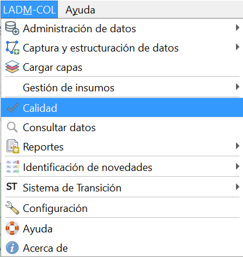

# Reglas de Calidad

El asistente LADM-COL cuenta con un conjunto de reglas de calidad que permiten comprobar temática y topológicamente el estado de los datos. 

Estas reglas de calidad se clasifican en 4 grupos:

- Reglas de calidad para puntos.
- Reglas de calidad para lineas.
- Reglas de calidad para polígonos.
- Reglas de calidad de consistencia lógica.

## Paso 1: Menú de control de calidad.

Dirigete a la ruta: **LADM-COL –> Calidad.**

## Paso 2: Ejecución de las reglas de calidad.

Se desplegará una interfaz de diálogo con cada una de las reglas de validación existentes, en esta ventana debes dar clic en el botón `Seleccionar todo` seguido del botón `Aceptar` para proceder a ejecutar todas las reglas de calidad.

## Paso 3: Resultados del control de calidad.

Una vez terminan de ejecutarse las reglas de calidad, se habilita el botón `Mostrar resultados`. Mediante el cual es posible desplegar un informe en el que se identifican las reglas que se validaron resaltadas en color rojo (cuando se encuentran errores de validación) o verde (sin errores de validación). Adicionalmente, se generan capas temporales asociadas a los errores de validación obtenidos, éstas se encuentran en el panel de *Capas* en el grupo *Errores de validación*.

TIP

Es posible exportar los resultados obtenidos de las reglas de validación. Para ello debes dar clic en el botón <i>Mostrar resultados -> Exportar PDF.</i>

TIP

También es posible exportar las capas geográficas y/o alfanuméricas con errores en una base de datos tipo GeoPackage. Para ello debes dar clic en el botón guardar, que se encuentra al lado del grupo <i>Errores de validación</i> dentro del panel de Capas.

