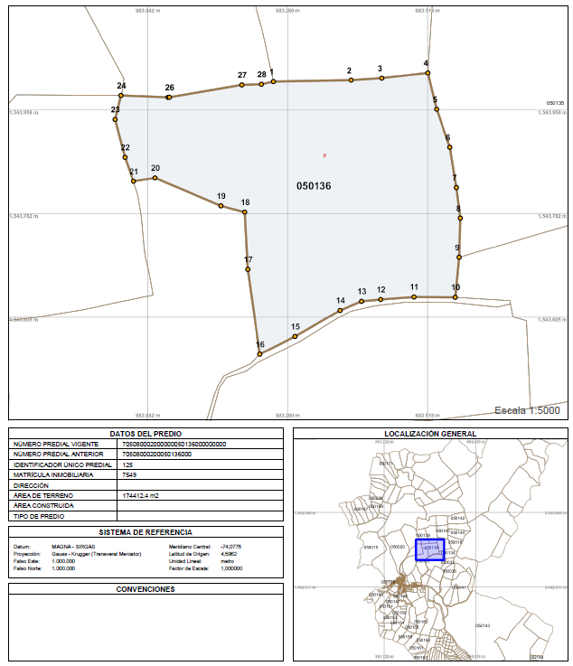
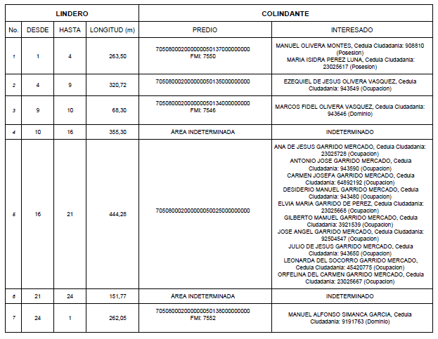
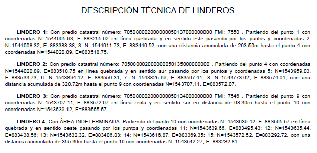
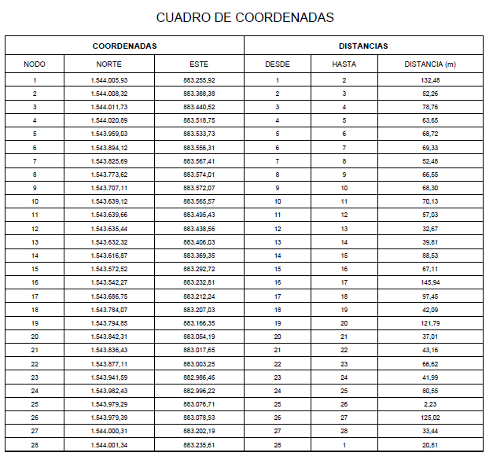
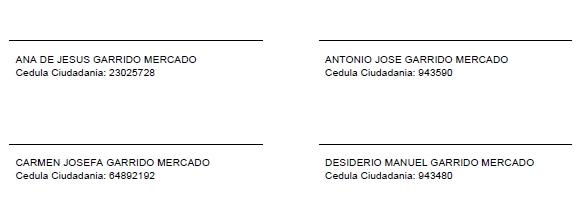
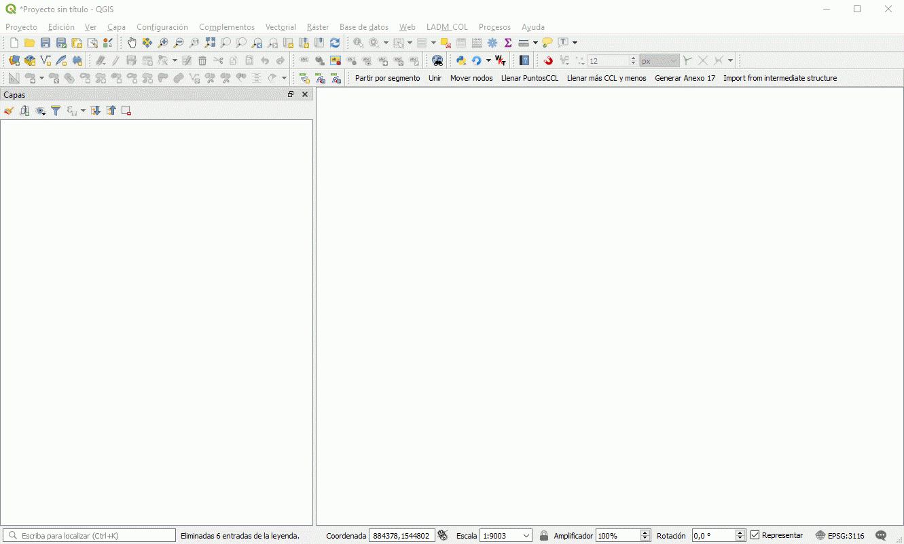

Toolbar LADM_COL
*****************

This is how toolbar looks like:

.. image:: static/ladm_col_toolbar.png
   :height: 25
   :width: 418
   :alt: LADM-COL toolbar

If the toolbar does not appear on the QGIS interface, you can make it show with
the next interaction: right click on the gray region in QGIS and clicking in
"LADM-COL Toolbar" or like in the following gif:

.. image:: static/show_ladm_col_toolbar.gif
   :height: 500
   :width: 800
   :alt: Show LADM-COL toolbar

Explode and Merge
=================

If you need to merge or explodes boundaries you can use the *merge* and *explode*
buttons on Toolbar LADM_COL.

.. image:: static/_UNIR_PARTIR_LINDERO.gif
   :height: 500
   :width: 800
   :alt: basic settings

Fill Points BFS
================

You can fill point bfs topology table using the button *Fill Point BFS* on
Toolbar LADM_COL which makes automatic and faster this job.

This are the tables that relate with this function:

- puntosccl --> puntolindero and lindero

.. image:: static/_LLENAR_TOPOLOGIAS_PUNTO_LINDERO.gif
   :height: 500
   :width: 800
   :alt: basic settings

Fill More BFS and Less
=======================

You can fill More BFS and Less topology table using the button *Fill More BFS
and Less* on Toolbar LADM_COL which makes automatic and faster this job.

This are the tables that relate with this function:

- masccl --> terreno and lindero
- menos --> terreno and lindero (holes or intern rings)

.. image:: static/_TOPOLOGIAS_TERRENO.gif
   :height: 500
   :width: 800
   :alt: basic settings

Generate Annex 17
=================

This option allows generating a document associated with the selected plots,
which corresponds to Annex 17, this contain a report of adjoining.

The adjoining report corresponds to the document where they will be identified
by property (with formal or informal tenure relations) each of the boundaries
that constitute it, its corresponding physical and legal relationship with
the properties surrounding it.

To generate the report of annex 17, follow these steps:

1. Select the plot (s) for which you want to generate the report.

2. Go to the toolbar and click on the button "Generate Annex 17"

Download dependencies. This step is done only once.

.. image:: static/annex_17_1.gif
   :height: 500
   :width: 800
   :alt: basic settings

3. You must indicate the directory where you want to store the generated documents.

4. Press ok should show a progress bar at the top, as in the following image:

5. You will obtain the validation of the generated reports with a message bar in green and inside it a link to the route where the files are located.
6. Go to the directory that you selected in step 3 to verify the result,
which should look like this in the following images:

.. image:: static/annex_17_2.gif
   :height: 500
   :width: 800
   :alt: basic settings

+ A map with detailed information of the plot.

+ A picture of adjoining

+ Technical description of boundaries

+ Coordinate box

+ Signatures

Import from intermediate structure
==================================

Este apartado esboza el procedimiento a seguir para poder realizar la
importación de datos masivamente desde archivos con formato de hoja de
calculo a una base de datos con la estructura del modelo LADM_COL.

Requisitos previos:
1. Datos coincidentes con la estructura intermedia, como se muestra en
las imagenes:

+ Estructura de Agrupación

.. image:: static/agrupacion.png
   :height: 500
   :width: 800
   :alt: basic settings

+ Estructura de Derecho:

.. image:: static/derecho.PNG
   :height: 500
   :width: 800
   :alt: basic settings

+ Estructura de Interesado:

.. image:: static/interesado.PNG
   :height: 500
   :width: 800
   :alt: basic settings

+ Estructura de Predio:

.. image:: static/predio.PNG
   :height: 500
   :width: 800
   :alt: basic settings

Plantilla en blanco de con estructura intermedia
Datos de ejemplo conformes con la estructura intermedia.

El procedimiento es el siguiente:

1. En la barra de herramientas dar click en el boton que dice: "Import from intermediate structure"
2. Seleccione el archivo con formato de hoja de calculo donde se encuentra almacenada la información a ser cargada.
3. aceptar el dialogo y esperar por el resultado.
4. confirmar que en QGIS se crearon las tablas intermedias y que las tablas del modelo implicadas quedaron con nuevos datos.
La ejecución del modelo con los datos de ejemplo debe genberar el siguiente resultado:
Tablas intermedias:

.. image:: static/tablas_intermed.PNG
   :height: 250
   :width: 400
   :alt: basic settings

Tablas del modelo implicadas:

.. image:: static/tabla_implicadas.PNG
   :height: 250
   :width: 400
   :alt: basic settings

Un ejemplo del procedimiento haciendo uso de los datos de ejemplo:

